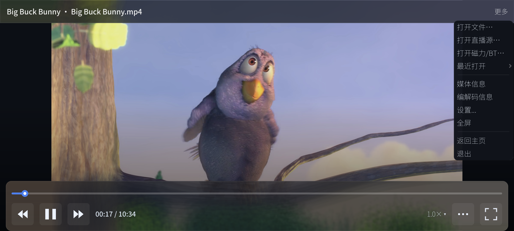

# avox

avox 是一套跨平台音视频能力库（C++17），提供从设备采集、硬解硬编、GPU 图像处理到渲染、推流录制的统一管线。播放器是当前最完整的模块；WebRTC 实时通话与 AI 能力（语音识别、机器翻译、图像修复、超分辨率）以插件形式按需整合；XR/VR·MR 相机标定与虚实融合（虚拟制片）模块已在生产环境验证并集成，虚拟人（数字人）模块正在集成；UE4/UE5、Unity3D、Godot 游戏引擎纹理级直通已打通。

[]()
[]()
[](LICENSE)
[]()
[]()

avox 源自作者多年的音视频/GPU 技术积累，经大模型辅助整理而成。技术脉络从早期 [OEIP](https://zhuanlan.zhihu.com/p/104027165)（UE4/Unity3D 多媒体管线）到 [aoce](https://github.com/xxxzhou/aoce)（Vulkan 跨平台 GPU 图像处理），关键实现过程均整理成系列技术文章（[天天不在](https://www.zhihu.com/people/zhou-xin-12-70-21/posts)），见下文[技术实现解析](#技术实现解析)。

## 项目优势

- **一套代码，多端运行** - Windows / Android / iOS / Linux 单一 C++17 代码库，CMake 统一构建；硬解硬编、GPU 互操作、窗口系统等平台差异在框架层抹平，扩展新平台只需实现平台层接口
- **接口一次定义，四语言绑定零手工成本** - 导出层为纯虚抽象接口 + `create*` 工厂 + `addXxxOb/removeXxxOb` 回调注册，禁用 STL 类型（`const char*`、裸指针+计数、回调类），SWIG 从同一套头文件自动生成 C# / Java / Node.js / Python 绑定；回调类经 director 机制在各语言中直接继承覆写，新增接口无需逐语言维护胶水层
- **全链路 GPU 零拷贝** - 硬解（DX11VA/MediaCodec/VideoToolbox）→ Vulkan 图像处理 → 硬编/渲染，数据全程留在 GPU 不经 CPU 中转；多数开源播放器方案未打通的端到端通路
  - **Windows** - D3D11VA 硬解帧以 DX11 纹理经 shared handle 与 Vulkan 互操作直入处理管线，结果回 DX11/DX12/Vulkan 渲染到窗口；MF 相机、屏幕捕获经统一数据源接口接入
  - **Android** - NdkCamera2 相机 OES 纹理直出、跨 EGLContext 与 Vulkan 互通，MediaCodec 硬解输出 AHardwareBuffer 直入管线，结果回 OpenGL ES/Vulkan 渲染到 Surface 或经 MediaCodec GPU 硬编推流
  - **iOS** - AVFoundation 相机帧与 VideoToolbox 硬解帧经 CVPixelBuffer/IOSurface 与 Vulkan/Metal 纹理互通直入管线，结果回 Metal/Vulkan 渲染或经 VideoToolbox 硬编推流
  - **游戏引擎** - UE4/UE5、Unity3D、Godot 纹理级零拷贝双向直通（相机/GPU 管线 → 引擎纹理，引擎 RenderTarget → 管线 → 推流）已打通
- **跟随上游的 WebRTC 整合** - 不 fork、不改 WebRTC 源码，以封装模块扩展解码工厂、AAC 解码、3A 音频、数据源/编码器映射，版本升级无源码包袱
- **插件化 AI 能力模块** - 语音识别、翻译、图像修复、目标检测等以动态插件运行期加载，与播放主链路解耦，按产品形态裁剪交付体积
- **游戏引擎深度接入** - UE4/UE5、Unity3D、Godot 纹理级零拷贝双向直通；播放、通话、AI 能力在引擎内原生可用，而非仅嵌一个播放窗口
- **真实场景验证，全程有据可查** - 直播播放、多平台双向通话、XR/VR·MR 相机标定与虚实融合（虚拟制片）等场景实战落地，关键实现均有系列技术文章与仓库文档对应，可读、可查、可复现

Android Godot GPU 直通播放磁力链接演示

## 核心特性

### 多源播放

- **直播流** - RTSP/RTMP/HTTP-FLV/HLS 等协议，ZLMediaKit 流媒体解析与 FFmpeg 双通道支持
- **本地媒体** - 支持常见音视频格式
- **设备采集** - 相机、麦克风、屏幕捕获统一数据源模型（Windows Media Foundation / Android NdkCamera2 OES 纹理直出 / iOS 相机）

### 跨平台硬解 · 零拷贝 GPU 通路

| 平台 | 硬件解码 | 硬解帧 → Vulkan 零拷贝通路 | 渲染后端 |
|------|----------|---------------------------|----------|
| Windows | DX11 (D3D11VA) | DX11 纹理 ↔ Vulkan 互操作 | DX11/DX12/Vulkan |
| Android | MediaCodec | AHardwareBuffer → Vulkan | OpenGL ES/Vulkan |
| iOS | VideoToolbox | IOSurface → Vulkan | Metal/Vulkan |
| Linux | VAAPI (计划中) | - | Vulkan |

- 硬解输出的原生 GPU 纹理直接进入 Vulkan 处理管线或映射到渲染窗口，不经 CPU 内存中转
- Vulkan ↔ OpenGL ES（Android）、Vulkan ↔ DX11（Windows）纹理互通
- Android 硬解与渲染跨 EGLContext 的处理、iOS 硬解经 Metal/IOSurface 的衔接均有实践方案

### 硬编与推流录制

- **Android** - MediaCodec GPU 编码：相机 OES 纹理经 Vulkan 处理后直接送编码器，全程不落地 CPU
- **iOS** - VideoToolbox 硬编：相机直出帧 / Vulkan 处理结果直接硬编
- **FFmpeg 软编** - 全平台兜底；封装器支持写本地文件与 RTMP/RTSP 推流
- **多平台双向视频通话** - 拉流→解码→渲染→编码→推流全链路（Windows/Android/iOS/Linux），各环节软硬方案可切换，支持同步录制到本地

### Vulkan GPU 图像处理

- 100+ 滤镜/特效：GPUImage 全系滤镜移植为 Vulkan Compute Shader
- Layer + PipeGraph 可组合计算管线图，跨平台 GPU 数据映射（OpenGL ES/Metal/DX11 → Vulkan）
- FreeType + Compute Shader 文本渲染，支持时间戳/字幕叠加
- Anime4K 超分辨率整合（GLSL 转 Vulkan Compute Shader，适配内置管线组合）
- 性能参考：1080p 单处理层 0.1~0.3ms（RTX 2070，见[滤镜耗时实测](https://zhuanlan.zhihu.com/p/1931653908276704034)）

### WebRTC 深度整合

- 不改动 WebRTC 源码，以封装模块方式扩展：
  - 播放器 H264/H265 软硬解接入 WebRTC 解码工厂（含 WebRTC M138 原生 H265 支持）
  - 集成 AAC 音频解码器（WebRTC 自身仅支持 opus/g711）
- 播放器数据源（IVideoSource/IAudioSource）与跨平台硬编编码器映射进 WebRTC 推流链路
- WebRTC 3A 音频处理（AEC 回声消除/ANS 降噪/AGC 增益）整合进采集推流
- WebRTC 数据直接渲染到播放器各平台原生窗口

### AI 能力

AI 模块以动态插件（`plugins/`）形式加载，运行期探测能力：

- **实时语音字幕** - SourcePlayer 采集麦克风/屏幕音频流式识别（约 200ms 延迟）；MediaPlayer 播放视频先识别后翻译生成中文字幕（基于 Sherpa-ONNX + 神经机器翻译）
- **AI 图像修复** - YOLO26-Seg 水印/物体实例分割 + 图像修复，全自动检测并去除（从帧差分+边缘分析的传统方案演进而来）
- **AI 推理** - ONNX Runtime / NCNN 通用推理（YOLO 检测、人脸关键点等），支持 Vulkan 显存直连输入输出
- **多模态 Agent** - LLM 集成，支持图文对话、工具链调用

### XR / VR·MR 相机标定与虚实融合（虚拟制片）

VR/MR 相机跟踪、虚拟制片相机标定、MR 虚实融合等相关模块已在生产环境验证并集成进 avox：

- **VR/MR 相机跟踪** - LED 虚拟拍摄相机跟踪，对标 Redspy/MoSys：单目+IMU、红外反光点方案
- **相机标定（虚拟制片标定）** - g2o 图优化内参标定、手眼标定、变焦镜头单图内参拟合
- **MR 虚实融合** - XR 拍摄虚实相机混合：相机标定 + 畸变校正，虚实融合重投影误差约 3 像素
- **虚拟人（数字人）** - 虚拟人驱动与渲染管线对接（模块正在集成）
- **超低延迟传输** - Rivermax（GPU Direct RDMA）/ NDI 局域网图像传输
- **游戏引擎直通** - UE4/UE5、Unity3D、Godot 纹理级零拷贝对接（platform/godot、platform/unity、platform/ue）

### 高级播放功能

- 音视频同步（仿 ffplay 同步逻辑，支持音频/视频/外部时钟）、倍速播放
- 低延迟自适应播放模式（直播场景动态调整缓冲）
- 动态软硬解切换、动态窗口切换
- 单播放器多路流支持
- **多框架可插拔集成** - 取流、解码、编码分层解耦，各层独立成源、可单独替换（IAVSource/IRawSource 抽象），不绑定 FFmpeg：
  - 内置方案开箱即用：FFmpeg（通用格式）、ZLMediaKit（RTSP/RTMP 直播）、WebRTC（实时通话），按源切换（IoPlan）
  - 私有协议以插件源形式接入：实现 IAVSource 即注册为新 IO 方案
  - 各方案共享同一套内置 H264/H265/AAC 软硬解码器与渲染管线，解码/编码实现也可单独替换
- **跨平台渲染** - ISurfaceRender 统一 Vulkan / DX11 / DX12 / Metal / OpenGL ES 窗口渲染，各平台硬解零拷贝直入对应渲染后端（外部内存共享/纹理直通）

### 多语言 SDK

- **C++** - 原生接口；**SWIG** 统一生成 C# / Java / Node.js / Python 绑定（含跨线程回调方案）
- 多平台 UI Demo：Win32、Android (Java)、iOS (ObjC)、[Electron (JS)](https://zhuanlan.zhihu.com/p/1943737922852460208)、[Avalonia (C#)](https://zhuanlan.zhihu.com/p/1991912977230733329)

## 技术实现解析

关键实现过程整理成系列技术文章（[天天不在 - 文章列表](https://www.zhihu.com/people/zhou-xin-12-70-21/posts)）：

**播放器框架与多平台移植**

- [播放器框架](https://zhuanlan.zhihu.com/p/1924535781558555955) - 多平台播放器框架总体设计
- [播放器FFmpeg](https://zhuanlan.zhihu.com/p/1924537408311001536) / [播放器Android](https://zhuanlan.zhihu.com/p/1924537652897625121) / [播放器IOS](https://zhuanlan.zhihu.com/p/1924537772141679194) / [播放器多平台Vulkan集成](https://zhuanlan.zhihu.com/p/1925515227908268800) / [播放器多平台Demo](https://zhuanlan.zhihu.com/p/1925515494309492633)
- [ZLMediaKit 播放流程中流媒体解析](https://zhuanlan.zhihu.com/p/1925912219486521028) - 直播协议解析
- [播放器时间相关功能](https://zhuanlan.zhihu.com/p/1948834769115780459) - 音视频同步、倍速、低延迟自适应

**零拷贝硬解 GPU 通路**

- [Vulkan与DX11交互](https://zhuanlan.zhihu.com/p/349534525) - Windows 硬解纹理直通 Vulkan
- [Android硬解经AHardwareBuffer高效到Vulkan管线](https://zhuanlan.zhihu.com/p/1933240978434679422)
- [IOS硬解经IOSurface高效到Vulkan管线](https://zhuanlan.zhihu.com/p/1933834616818636429)
- [android下vulkan与opengles纹理互通](https://zhuanlan.zhihu.com/p/302285687)
- [NdkCamera2使用OES纹理渲染](https://zhuanlan.zhihu.com/p/1967658409848440079) - 相机零拷贝采集

**硬编与实时通话**

- [Android MediaCodec GPU编码实践](https://zhuanlan.zhihu.com/p/1977347530166666089) / [IOS硬编实践](https://zhuanlan.zhihu.com/p/1987119873403417887)
- [多平台双向视频通话](https://zhuanlan.zhihu.com/p/1987128340973368623) - 全链路软硬方案切换
- [播放器整合WebRTC音频3A处理](https://zhuanlan.zhihu.com/p/1963601511633389459)

**WebRTC 整合**

- [播放器WebRTC](https://zhuanlan.zhihu.com/p/1929598509927076242) - 集成总览
- [WebRTC集成本地播放器解码器实践](https://zhuanlan.zhihu.com/p/1938686818565494734) - H264/H265 软硬解接入
- [WebRTC 集成 AAC 解码器](https://zhuanlan.zhihu.com/p/1941208736648636312)
- [WebRTC音视频源和编码器映射](https://zhuanlan.zhihu.com/p/2000598286206248428)

**Vulkan 图像处理**

- GPUImage 移植系列：（一）[高斯模糊与自适应阈值](https://zhuanlan.zhihu.com/p/356355306)、（二）[Harris角点与导向滤波](https://zhuanlan.zhihu.com/p/359787506)、（三）[A到C滤镜](https://zhuanlan.zhihu.com/p/364888786)、（四）[D到O滤镜](https://zhuanlan.zhihu.com/p/369930003)、（五）[P到Z滤镜](https://zhuanlan.zhihu.com/p/372843997)、[总结](https://zhuanlan.zhihu.com/p/373137758)、[安卓Demo](https://zhuanlan.zhihu.com/p/388055520)
- [Vulkan滤境时间](https://zhuanlan.zhihu.com/p/1931653908276704034) - 管线层级性能实测
- [播放器Vulkan渲染文本](https://zhuanlan.zhihu.com/p/1963601925418234137) - FreeType 字幕/时间戳
- [播放器整合Anime4K超分](https://zhuanlan.zhihu.com/p/2043258134546974507)

**AI 与算法**

- [播放器实时语音字幕识别与翻译](https://zhuanlan.zhihu.com/p/2035763455190373290)
- [AI 图像修复](https://zhuanlan.zhihu.com/p/2037495059705221313) - YOLO-Seg 水印去除
- [NCNN优化实时面部关键点检测](https://zhuanlan.zhihu.com/p/407299327) / [使用NCNN的Vulkan输入输出](https://zhuanlan.zhihu.com/p/411106967) - 端侧推理显存直连
- [CUDA版Grabcut的实现](https://zhuanlan.zhihu.com/p/59283449)（早期 GPU 分割实践）

**工程实践**

- [使用Swig转换C++到别的编程语言](https://zhuanlan.zhihu.com/p/379049985) / [Swig与Node.js原生扩展的跨线程回调](https://zhuanlan.zhihu.com/p/1969758141236372869)

## 技术演进与 XR / 虚拟制片

avox 的能力来自多年的持续积累：

| 阶段 | 项目 | 主要产出 |
|------|------|----------|
| 2019-2020 | oeip（Windows） | CUDA/DX11 图像管线、FFmpeg 推拉流、UE4/Unity3D 纹理直通、CUDA Grabcut/导向滤波、YOLO 整合游戏引擎 |
| 2020-2021 | [aoce](https://github.com/xxxzhou/aoce)（跨平台） | Vulkan Compute 图像管线、GPUImage 100+ 滤镜移植、Android/iOS 相机采集、蓝绿幕扣像、NCNN 端侧推理、SWIG 多语言 |
| 2024-至今 | avox | 播放器 SDK：多平台硬解硬编、零拷贝 GPU 通路、WebRTC 全家桶、AI 字幕/修复/超分、多语言 SDK；XR/VR·MR 相机标定与虚实融合模块已集成 |

**XR / 虚拟制片模块**（VR/MR 相机跟踪、虚拟制片标定、MR 虚实融合等，前期在 aoce 上完整验证，已集成进 avox）：

- VR/MR 相机跟踪 — LED 虚拟拍摄相机跟踪（[跟踪算法](https://zhuanlan.zhihu.com/p/705932365)，对标 Redspy/MoSys：单目+IMU、红外反光点方案）
- MR 虚实融合 — XR 拍摄虚实相机混合（[实现解析](https://zhuanlan.zhihu.com/p/705965901)，标定+畸变校正，重投影误差约 3 像素）
- 仿 SLAM 流程生成 LED 幕墙点云/Mesh（[实现解析](https://zhuanlan.zhihu.com/p/705975323)，ORB_SLAM3）
- 虚拟制片相机标定 — g2o 图优化重写相机内参标定（[实现解析](https://zhuanlan.zhihu.com/p/705988110)，重投影误差建模）
- Rivermax 超低延迟图像传输（[实现解析](https://zhuanlan.zhihu.com/p/706037895)，GPU Direct RDMA，解决 NDI 100ms+ 延迟不可接受的问题）
- UE4/UE5、Unity3D 纹理级直通对接（相机→GPU 管线→引擎纹理，引擎 RenderTarget→管线→推流）
- 虚拟人（数字人）驱动与渲染管线对接（模块正在集成）

## 快速开始

### 编译环境

- CMake 3.16+
- Visual Studio 2019+ (Windows)
- NDK 26.1.10909125 (Android)
- Xcode 14+ (iOS)
- GCC/Clang 及 Vulkan SDK (Linux)

### 外部依赖库

大型依赖库（WebRTC、ONNX Runtime、OpenCV 等）存放在与本项目同级的 `../avc_library` 目录，默认自动查找。可通过环境变量或 CMake 参数自定义：

```bash
export AVOX_EXTERNAL_LIBRARY_DIR=/path/to/avc_library
# 或
cmake -DAVOX_EXTERNAL_LIBRARY_DIR=/path/to/avc_library ...
```

### 编译命令

```bash
python build_windows.py   # Windows x64
python build_android.py   # Android arm64-v8a/armeabi-v7a
python build_ios.py       # iOS arm64/x86_64
python build_linux.py     # Linux x64

# 单元测试 (随构建自动编译, 手动运行:)
ctest --test-dir build/windows/avplay --output-on-failure -C Release
```

编译脚本支持自定义构建类型（Debug/Release）和目标架构，详见 [doc/build/构建.md](doc/build/构建.md) 及各脚本内的配置项。

## 目录结构

```
avox/
├── src/                       # 核心 SDK 源码
│   ├── avox/                   # 核心播放器框架 (avox 模块)
│   │   ├── player/            # MediaPlayer / SourcePlayer 实现
│   │   ├── source/            # 数据源 (IAVSource / IRawSource)
│   │   ├── video/ audio/      # 视频/音频解码器基类
│   │   ├── codec/             # 编解码抽象
│   │   ├── muxer/             # 媒体复用
│   │   ├── subtitle/          # 字幕
│   │   ├── layer/             # 图层合成
│   │   ├── module/            # 动态模块管理 (IModule / ModuleMgr)
│   │   └── neural/            # 神经网络/AI 接口
│   ├── avox_aac/               # AAC 解码 (faad2/fdk-aac)
│   ├── avox_ffmpeg/            # FFmpeg 解封装/软解/硬解
│   ├── avox_zlmediakit/        # ZLMediaKit 直播流 (RTSP/RTMP)
│   ├── avox_vulkan/            # Vulkan GPU 处理管线
│   ├── avox_freetype/          # FreeType 文字渲染
│   ├── avox_egl/               # EGL 上下文
│   ├── avox_agent/             # 多模态 AI Agent
│   ├── avox_cmd/               # 命令行接口 (CLI)
│   ├── avox_windows/           # Windows 平台实现
│   ├── avox_android/           # Android 平台实现
│   ├── avox_ios/               # iOS 平台实现
│   └── avox_linux/             # Linux 平台实现
├── plugins/                   # 动态插件模块 (运行期加载)
│   ├── avox_webrtc/            # WebRTC 集成
│   ├── avox_onnx/              # ONNX 推理
│   ├── avox_opencv/            # OpenCV 图像处理
│   ├── avox_sherpa/            # Sherpa-ONNX 语音识别
│   ├── avox_translation/       # 神经机器翻译
│   └── avox_cv/                # AI 图像修复 (水印去除) + 通用 YOLO
├── swig/                      # SWIG 多语言绑定
│   ├── csharp/                # C# SDK
│   ├── nodejs/                # Node.js SDK
│   └── python/                # Python SDK
├── platform/                  # 各平台 SDK 封装与 UI 演示
│   ├── windows/ android/ ios/
│   └── avalonia/              # Avalonia 跨平台 C# Demo
├── samples/                   # 功能测试示例
├── glsl/                      # Vulkan GLSL 着色器 (.glsl → .spv)
├── cmake/                     # CMake 构建脚本与工具链
├── script/                    # 辅助脚本 (下载依赖、打包等)
├── 3rdparty/                  # 第三方依赖库源码
├── assets/                    # 资源文件 (字体、图片、模型)
├── doc/                       # 项目文档
└── build/                     # 构建输出目录
```

## 架构概览

```
┌─────────────────────────────────────────────────────────────┐
│                      Application Layer                       │
│           (C# / Java / JS / Python / Swift / ObjC)          │
├─────────────────────────────────────────────────────────────┤
│                      SDK Layer (SWIG)                        │
├─────────────────────────────────────────────────────────────┤
│                       Core Player                            │
│  ┌──────────┐  ┌──────────┐  ┌──────────┐  ┌──────────┐   │
│  │ IO Thread │→ │ Decoder  │→ │ Render   │→ │ Output   │   │
│  │           │  │ Thread   │  │ Thread   │  │          │   │
│  └──────────┘  └──────────┘  └──────────┘  └──────────┘   │
├─────────────────────────────────────────────────────────────┤
│  Data Sources          Decoders           Renders           │
│  ┌─────────────┐      ┌─────────┐        ┌──────────┐      │
│  │ FFmpeg      │      │ HW:     │        │ DX11/12  │      │
│  │ ZLMediaKit  │      │ MediaCodec│       │ Metal    │      │
│  │ WebRTC      │      │ VideoToolbox│     │ Vulkan   │      │
│  │ Device      │      │ SW: FFmpeg│       │ OpenGL ES│      │
│  └─────────────┘      └─────────┘        └──────────┘      │
├─────────────────────────────────────────────────────────────┤
│  Vulkan GPU Pipeline        │        Dynamic Plugins        │
│  (100+ Effects)             │   (WebRTC / ONNX / ASR / ...) │
└─────────────────────────────────────────────────────────────┘
```

## API 说明

- **create** 前缀 API - 返回需要手动释放的对象（调用者持有所有权）
- **get** 前缀 API - 返回托管对象，无需手动释放
- 回调注册：`addXxxOb()` / `removeXxxOb()`，回调对象释放前须先注销

```cpp
IMediaPlayer* player = createMediaPlayer();          // 用户所有，需 delete
ISurfaceRender* render = player->getSurfaceRender(); // 托管，不释放
```

## 文档

- **[doc/INDEX.md](doc/INDEX.md)** - 项目文档总索引（模块说明、API、平台集成、构建配置）
- **[DeveloperGuide.md](DeveloperGuide.md)** - C++ 编码规范与跨 DLL 安全规范
- **[CLAUDE.md](CLAUDE.md)** - 项目结构概览与 AI 辅助开发指引

## 许可证

- 本项目核心代码基于 [GNU AGPL-3.0](LICENSE) 开源：可自由使用、学习、修改和分发；基于本 SDK 的衍生作品（含插件）分发时须同样以 AGPL-3.0 开源。
- **商业授权** - 闭源商用场景（商业插件、嵌入式产品集成等）可联系作者获取商业授权（[天天不在](https://www.zhihu.com/people/zhou-xin-12-70-21/posts) / GitHub Issues）。
- 第三方依赖（FFmpeg、WebRTC、OpenCV 等）遵循各自的开源协议，详见 [3rdparty/README.md](3rdparty/README.md)。
