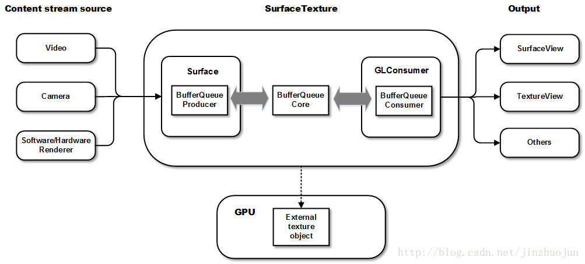

# NDK开发

## 文档

[Android NDK 开发中正确释放 JNI 对象](https://www.jianshu.com/p/5cde114159d4)

[NDK中使用mediacodec解码h264](https://blog.csdn.net/u012459903/article/details/113046538)

[Android MediaCodec 简明教程](https://blog.csdn.net/weiwei9363/article/details/139291539)

[音视频编解码--MediaCodec实战优化](https://zhuanlan.zhihu.com/p/375291451)

[SurfaceView, TextureView, SurfaceTexture等的区别](https://www.cnblogs.com/wytiger/p/5693569.html)

[Android原生编解码接口 MediaCodec 之——踩坑](https://www.jianshu.com/p/6eebc6bcbea1)

