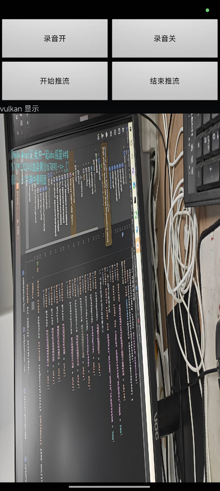

# NdkCamera2使用OES纹理渲染

网上很多NdkCamera2的例子，但是都是通过AImageReader读取图像，然后map到opengles/vulkan渲染，图像资源占用大，有些浪费，这里讲下如下通过OES纹理渲染读取并使用opengles/vulkan渲染，现在效果，上次的字体渲染在android里也可以直接用。



## SurfaceTexture

SurfaceTexture内部封装了一个先进先出的图像队列，消费者通过updateTexImage获取图像，生产者通过onFrameAvailable通知消费者有新的图像，在之前[Android硬解](Android硬解Vulkan.md)就有用到，解码时提供一个SurfaceTexture，解码提供在队列的索引，渲染时把索引的图像先updateTexImage获取，再渲染到opengles/vulkan。

在解码时没用到onFrameAvailable，因为解码取数据封装了这一过程，如果用OES纹理显示NdkCamera2的图像，就需要自己管理了，在原JniSurfaceTexture添加相应封装。

``` C++
class JniSurfaceTexture {
  // 添加帧可用回调接口
  using FrameAvailableCallback = std::function<void()>;
  // 设置帧可用回调
void JniSurfaceTexture::setOnFrameAvailableListener(
    FrameAvailableCallback callback) {
  frameAvailableCallback = callback;
  AVOX_GET_ENV
  // 如果没有，则创建一个，否则不需要再次创建了
  if (!surfaceTextureOb && frameAvailableCallback) {
    if (!jmSurfaceTextureOb.surfaceTexureObClass || !jmSurfaceTextureOb.init) {
      LOGFLF(LogLevel::warn, "surfaceTextureObClass or init is nullptr");
      return;
    }
    // 将this指针转换为jlong传递给Java
    jlong nativePtr = reinterpret_cast<jlong>(this);
    jobject jSurfaceTextureOb =
        env->NewObject(jmSurfaceTextureOb.surfaceTexureObClass,
                       jmSurfaceTextureOb.init, nativePtr);
    surfaceTextureOb = env->NewGlobalRef(jSurfaceTextureOb);
    env->DeleteLocalRef(jSurfaceTextureOb);
  }
  env->CallVoidMethod(surfaceTexture,
                      jmSurfaceTexture.setOnFrameAvailableListener,
                      frameAvailableCallback ? surfaceTextureOb : nullptr);
}
};
```

jmSurfaceTextureOb对应的Java类如下：

``` Java
public class AvoxSurfaceTextureOb implements SurfaceTexture.OnFrameAvailableListener {
    // 指向C++对象的指针
    private long nativePtr = 0;
    public AvoxSurfaceTextureOb(long ptr) {
        nativePtr = ptr;
    }

    @Override
    public void onFrameAvailable(SurfaceTexture surfaceTexture) {
        nativeOnFrameAvailable(nativePtr);
    }

    // 转JNI方法
    private static native void nativeOnFrameAvailable(long nativePtr);
}
JNIEXPORT void JNICALL
Java_avox_android_library_AvoxSurfaceTextureOb_nativeOnFrameAvailable(
    JNIEnv *env, jclass clazz, jlong texturePtr) {
  JniSurfaceTexture *surfaceTexture =
      reinterpret_cast<JniSurfaceTexture *>(texturePtr);
  if (surfaceTexture) {
    surfaceTexture->onFrameAvailable();
  }
}
```

简单来说，就是创建一个Java对象，这个对象保持一个指向C++ SurfaceTexture的指针，在java SurfaceTexture的onFrameAvailable里回调到了后，就转发到C++设置的std::function<void()>上。

## 读取图像到OES纹理

不使用AImageReader的话，一般自己开线程，在这个线程里初始化EGL环境，创建SurfaceTexture/OES纹理，绑定surfaceTexture与纹理，然后不断更新并发出数据。

``` C++
bool AndCameraSource::openSurfaceTexture() {
  nativeWindow = nullptr;
  // 初始化EGL环境
  initContext(EGL_NO_CONTEXT);
  if (eglGetCurrentContext()) {
    surfaceTexture = std::make_unique<JniSurfaceTexture>();
    // 从GPU队列取出来的存放的OES纹理
    glGenTextures(1, &textureId);
    AVOX_GL_LOG("gen texture failed.");
    glBindTexture(GL_TEXTURE_EXTERNAL_OES, textureId);
    glTexParameterf(GL_TEXTURE_EXTERNAL_OES, GL_TEXTURE_MIN_FILTER, GL_LINEAR);
    glTexParameterf(GL_TEXTURE_EXTERNAL_OES, GL_TEXTURE_MAG_FILTER, GL_LINEAR);
    glTexParameteri(GL_TEXTURE_EXTERNAL_OES, GL_TEXTURE_WRAP_S,
                    GL_CLAMP_TO_EDGE);
    glTexParameteri(GL_TEXTURE_EXTERNAL_OES, GL_TEXTURE_WRAP_T,
                    GL_CLAMP_TO_EDGE);
    surfaceTexture->init(textureId);
    surfaceTexture->setImageSize(curDesc.width, curDesc.height);
    nativeWindow = surfaceTexture->getNativeWindow();
    LOGFLF(LogLevel::info, "textureId:", textureId, " width:", curDesc.width,
           " height:", curDesc.height, " nativeWindow:", nativeWindow);
    return true;
  }
  return false;
}

bool AndCameraSource::createCaptureSession() {
...
// 使用surfaceText的nativewindow作为输出目录
// 先创建ACameraOutputTarget，再添加到捕获请求
  ACameraOutputTarget *outputTarget = nullptr;
  status = ACameraOutputTarget_create(nativeWindow, &outputTarget);
  if (status != ACAMERA_OK) {
    LOGFLF(LogLevel::warn, "failed to create camera output target:", status);
    return false;
  }
  status = ACaptureRequest_addTarget(captureRequest, outputTarget);
  if (status != ACAMERA_OK) {
    LOGFLF(LogLevel::warn, "failed to add target to capture request:", status);
    ACameraOutputTarget_free(outputTarget);
    return false;
  }
// 别的过程同AImageReader
}

结合上面EGL上下文里，根据SurfaceTexture回调刷新纹理，保持循环。

``` C++
void AndCameraSource::onRunTask() {
  // 打开EGL环境，并创建SurfaceTexture对象，并绑定到EGL环境中
  bool bOpen = openSurfaceTexture();
  if (bOpen) {
    // 打开相机设备，创建CaptureSession
    bOpen = createCaptureSession();
  }
  if (bOpen) {
    std::condition_variable frameCv;
    std::mutex frameMutex;
    // 通知surfaceTexture可用
    std::function<void()> onAvailable = [&frameCv]() { frameCv.notify_one(); };
    surfaceTexture->setOnFrameAvailableListener(onAvailable);
    while (running()) {
      // 填充GpuFrame
      GpuFrame frame = {};
      frame.format.width = curDesc.width;
      frame.format.height = curDesc.height;
      frame.format.type = YuvType::nv12;
      frame.pts = timeStampMS();
      frame.dts = frame.pts;
      frame.context = this;
      // HighClock clock = {};
      onFrame(frame);
      // log(LogLevel::debug, "camera cost:", clock.recordDelta());
      // 通知surfaceTexture继续更新
      surfaceTexture->updateTexImage();
      // 等待surfaceTexture可用
      std::unique_lock<std::mutex> lock(frameMutex);
      frameCv.wait_for(lock, std::chrono::milliseconds(200));
    }
    surfaceTexture->setOnFrameAvailableListener(nullptr);
  }
  cleanup();
}
```

读取并通过Opengles渲染1080P的图像，我的红米K70整个渲染时间在1ms左右.

## 渲染

[Android硬解](Android硬解Vulkan.md)里面有说如何渲染到opengles/vulkan，不过有些不同的是，硬解里的解码线程与渲染线程不是同一个，而在这里，读出OES纹理然后直接渲染到opengles/vulkan了，应该说是还简单了些，但是还是要对之前的代码做些改动。

``` C++
void GLESContext::initContext(EGLContext sharedCtx,
                              EGLNativeWindowType window) {
 shardCtx = sharedCtx;
#ifdef __ANDROID__
  // 一个线程只有一个context保持激活
  selfCtx = eglGetCurrentContext();
  eglsurface = eglGetCurrentSurface(EGL_DRAW);
  // 当前线程还没创建上下文，则先初始化EGLDisplay
  if (selfCtx == EGL_NO_CONTEXT) {
    bSelfCtx = true;
    EGLint majorVersion = 0;
    EGLint minorVersion = 0;
    display = eglGetDisplay(EGL_DEFAULT_DISPLAY);
    if (display == EGL_NO_DISPLAY) {
      LOGFLF(LogLevel::warn, "egl Display is null");
      return;
    }
    if (!eglInitialize(display, &majorVersion, &minorVersion)) {
      AVOX_EGL_LOG("eglInitialize failed.");
      return;
    }
    LOGFLF(LogLevel::info, "eglInitialize success, egl display:", display,
           " majorVersion:", majorVersion, " minorVersion:", minorVersion);
  } else {
    bSelfCtx = false;
    // 使用之前初始化的display,只用来创建surface
    display = eglGetCurrentDisplay();
  }
  ...
}

```

简单来说，相机和渲染都initContext了一次，但是二者是同一个，直接创建新的会使老的失效，导致相机读不出数据了，那么后面渲染对象检查到当前线程已经有EGL上下文，直接使用老的EGL上下文，只是后面的initContext会在java提供的SurfaceView的nativewindow创建一个渲染表面。

用来测试java端的例子。

``` java
protected void onCreate(Bundle savedInstanceState) {
    ...
     //
    SurfaceView surfaceView = findViewById(R.id.surface_view);
    // 声明源播放器并绑定设备
    sourcePlayer = AvoxWrapper.createDevicePlayer();
    videoRender = new VideoRender();
    // 最后参数false是opengles渲染，否则用vulkan渲染
    videoRender.init(sourcePlayer.getSurfaceRender(),surfaceView,true);
    // AudioRecord
    IAudioManager audioManager = AvoxWrapper.getAudioManager(ADeviceSdk.android);
    audioSource = audioManager.getDevice(0);
    // Camera
    IVideoManager videoManager = AvoxWrapper.getVideoManager(VDeviceSdk.and_ndkcamer2);
    videoSource = videoManager.getDevice(0);
    // 绑定音视频设备到播放器
    AvoxWrapper.setPlayAudioSource(sourcePlayer,audioSource);
    AvoxWrapper.setPlayVideoSource(sourcePlayer,videoSource);
    // 媒体复用
    mediaMuxer = sourcePlayer.getMuxer();
}
public void onClick(View v) {
    if(v.getId() == R.id.btnAudioStart){
        sourcePlayer.open();
    }else if(v.getId() == R.id.btnAudioStop){
        sourcePlayer.close();
    }else if(v.getId() == R.id.btnPushStart){
        mediaMuxer.open("rtsp://192.168.1.100/live/test");
    }else if(v.getId() == R.id.btnPushStop){
        mediaMuxer.close();
    }    
}
```


