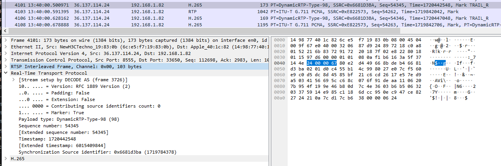
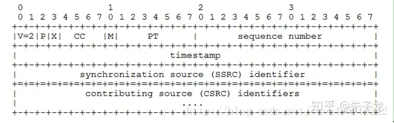
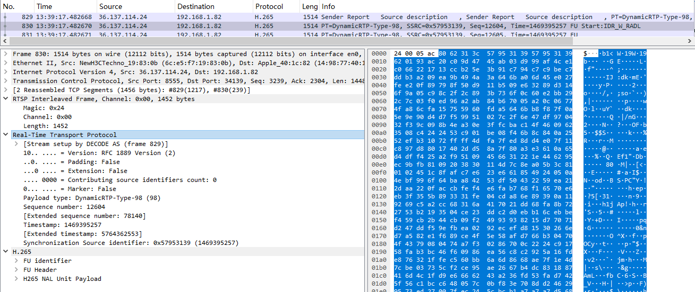
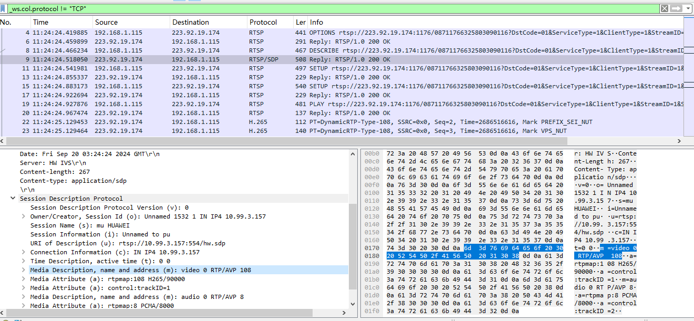
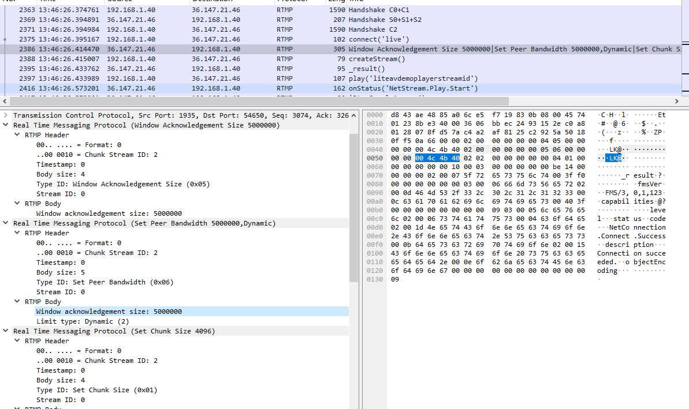
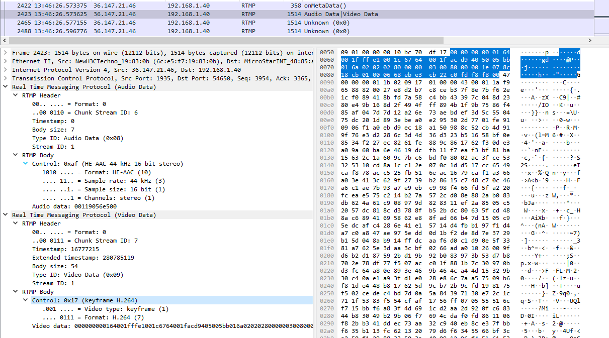
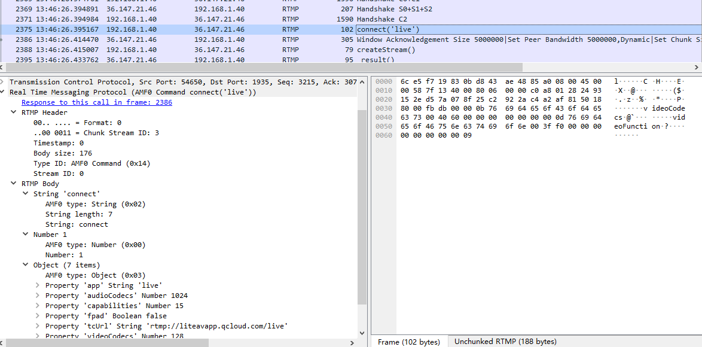
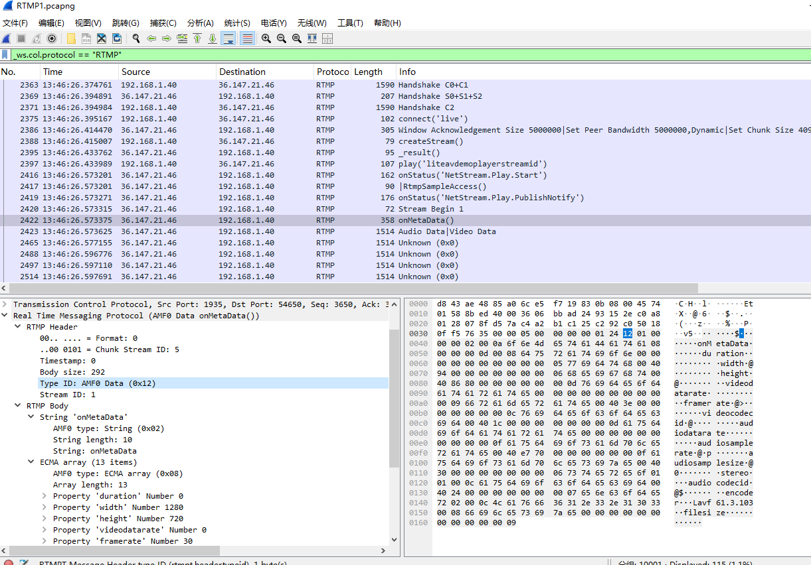
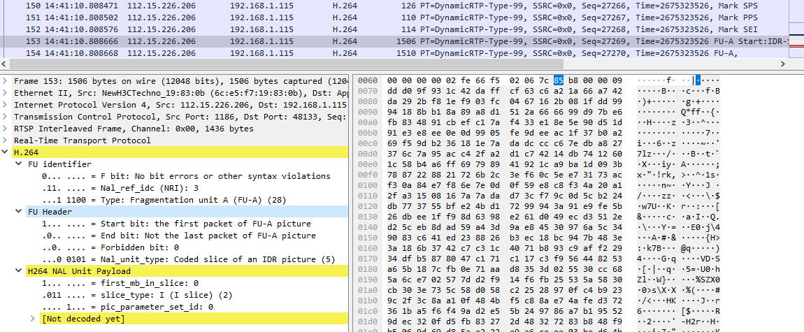
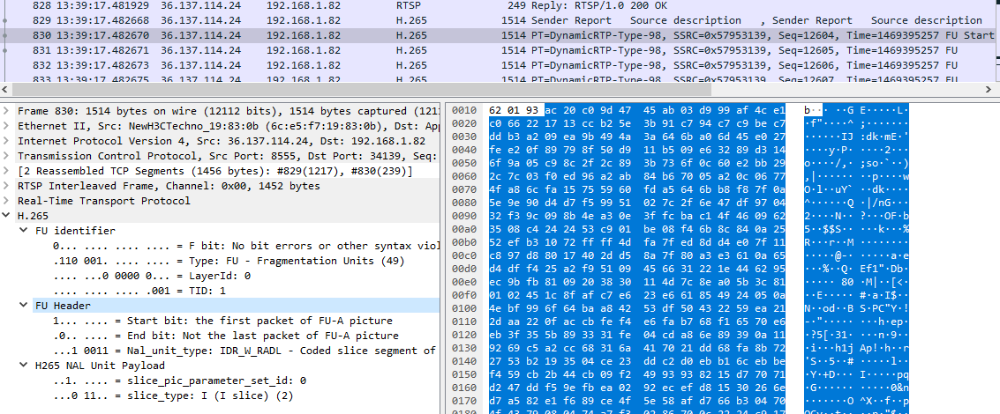

# ZLMediaKit 播放流程中流媒体解析

多媒体开发，根据 ZLMediaKit 学习流媒体中网络协议如何解析，主要是RTP/RTSP/RTMP 协议，以及H264/H265 编码。

## 基本流程

在看 ZLMediaKit 时，有几个主要的疑问，大致如下，以及找到的答案。

### 如何根据拉流地址确定用什么协议？

配置好 test_player,查看根据协议生成具体 Player 过程。

```C++
// 传入拉流地址
mediakit::MediaPlayer::play(const std::string & url)
// 解析拉流地址，生成具体的子类
mediakit::PlayerBase::createPlayer(const std::shared_ptr<toolkit::EventPoller> & in_poller, const std::string & url_in)
mediakit::RtspPlayerImp::RtspPlayerImp(const std::shared_ptr<toolkit::EventPoller> & poller)
// RTSP流，需要对应的RtspPlayer处理
mediakit::RtspPlayer::RtspPlayer(const std::shared_ptr<toolkit::EventPoller> & poller)

// 在这根据拉流地址，创建不同的Player
PlayerBase::Ptr PlayerBase::createPlayer(const EventPoller::Ptr &in_poller, const string &url_in) {
    ...
    string url = url_in;
    string prefix = findSubString(url.data(), NULL, "://");
    auto pos = url.find('?');
    if (pos != string::npos) {
        // 去除？后面的字符串  [AUTO-TRANSLATED:0ccb41c2]
        // Remove the string after the question mark
        url = url.substr(0, pos);
    }
    if (strcasecmp("rtsps", prefix.data()) == 0) {
        return PlayerBase::Ptr(new TcpClientWithSSL<RtspPlayerImp>(poller), release_func);
    }
    if (strcasecmp("rtsp", prefix.data()) == 0) {
        return PlayerBase::Ptr(new RtspPlayerImp(poller), release_func);
    }
    if (strcasecmp("rtmps", prefix.data()) == 0) {
        return PlayerBase::Ptr(new TcpClientWithSSL<RtmpPlayerImp>(poller), release_func);
    }
    if (strcasecmp("rtmp", prefix.data()) == 0) {
        return PlayerBase::Ptr(new RtmpPlayerImp(poller), release_func);
    }
    if ((strcasecmp("http", prefix.data()) == 0 || strcasecmp("https", prefix.data()) == 0)) {
        if (end_with(url, ".m3u8") || end_with(url_in, ".m3u8")) {
            return PlayerBase::Ptr(new HlsPlayerImp(poller), release_func);
        }
        if (end_with(url, ".ts") || end_with(url_in, ".ts")) {
            return PlayerBase::Ptr(new TsPlayerImp(poller), release_func);
        }
        if (end_with(url, ".flv") || end_with(url_in, ".flv")) {
            return PlayerBase::Ptr(new FlvPlayerImp(poller), release_func);
        }
    }
    throw std::invalid_argument("not supported play schema:" + url_in);
}
```

可以看到实际处理其实是 PlayerBase 对应子类实现。

### PlayerBase 这个基类包含那些定义与方法来处理音视频。

先查看和这个类相关的一些类，简化一些方法与强化注释。

```C++
// 编码信息的抽象接口
class CodecInfo {
    // 获取编解码器类型(如H264,H265,AAC,G711A,VP8等)
    virtual CodecId getCodecId() const = 0;
    // 获取音视频类型(TrackVideo,TrackAudio,TrackTitle)
    TrackType getTrackType() const;
}

// 帧类型的抽象接口
class Frame : public toolkit::Buffer, public CodecInfo {
    // 返回解码时间戳，单位毫秒
    virtual uint64_t dts() const = 0;
    // 返回显示时间戳，单位毫秒
    virtual uint64_t pts() const { return dts(); }
    // H264/H265 前缀可能是3/4,aac为7
    virtual size_t prefixSize() const = 0;
    // 返回是否为关键帧
    virtual bool keyFrame() const = 0;
    // 是否为配置帧，譬如sps pps vps
    virtual bool configFrame() const = 0;
    // 是否为可解码帧, sps pps等帧不能解码
    virtual bool decodeAble() const {
        if (getTrackType() != TrackVideo) {
            return true;
        }
        // 默认非sps pps帧都可以解码  [AUTO-TRANSLATED:b14d1e34]
        return !configFrame();
    }
}

// 支持代理转发的帧环形缓存
class FrameDispatcher : public FrameWriterInterface {
private:
    mutable std::mutex _mtx;
    std::map<void *, FrameWriterInterface::Ptr> _delegates;
public:
    // 写入帧并派发
    bool inputFrame(const Frame::Ptr &frame) override {
        std::lock_guard<std::mutex> lck(_mtx);
        bool ret = false;
        for (auto &pr : _delegates) {
            if (pr.second->inputFrame(frame)) {
                ret = true;
            }
        }
        return ret;
    }
}

// 媒体通道描述类，也支持帧转发
class Track : public FrameDispatcher, public CodecInfo {
    // 是否准备好，准备好才能获取譬如sps pps等信息
    virtual bool ready() const = 0;
    // 更新track信息，比如触发sps/pps解析
    virtual bool update() { return false; }
    // 生成sdp
    virtual Sdp::Ptr getSdp(uint8_t payload_type) const = 0;
}
// 视频通道描述Track类，支持获取宽高fps信息
class VideoTrack : public Track {
public:
    using Ptr = std::shared_ptr<VideoTrack>;
    // 长，宽，FPS
    virtual int getVideoHeight() const { return 0; }
    virtual int getVideoWidth() const { return 0; }
    virtual float getVideoFps() const { return 0; }
    // sps/pps
    virtual std::vector<Frame::Ptr> getConfigFrames() const { return std::vector<Frame::Ptr>{}; }
}
// 音频Track派生类，支持采样率通道数，采用位数信息
class AudioTrack : public Track {
    // 音频采样率,采样位数,通道数
    virtual int getAudioSampleRate() const  {return 0;};
    virtual int getAudioSampleBit() const {return 0;};
    virtual int getAudioChannel() const {return 0;};
}

// 能添加Track，在添加完后通知
class TrackListener {
    // 添加track，内部会调用Track的clone方法
    // 只会克隆sps pps这些信息 ，而不会克隆Delegate相关关系
    virtual bool addTrack(const Track::Ptr & track) = 0;
    // 添加track完毕
    virtual void addTrackCompleted() {};
    virtual void resetTracks() {};
}

// 流上所有媒体通道描述类
class TrackSource {
    // 获取全部的Track
    virtual std::vector<Track::Ptr> getTracks(bool trackReady = true) const = 0;
    // 获取特定Track
    Track::Ptr getTrack(TrackType type , bool trackReady = true) const {};
}

// 解复用器,在拿到流编码信息后生成
class Demuxer : protected TrackListener, public TrackSource {
public:
    // TrackSource默认实现
    void setTrackListener(TrackListener *listener, bool wait_track_ready = false);
    std::vector<Track::Ptr> getTracks(bool trackReady = true) const override;

protected:
    // TrackListener的默认实现
    bool addTrack(const Track::Ptr &track) override;
    void addTrackCompleted() override;
    void resetTracks() override;

private:
    MediaSink::Ptr _sink;
    TrackListener *_listener = nullptr;
    std::vector<Track::Ptr> _origin_track;
};

// RTMP/RTSP播放流的基类
class PlayerBase : public TrackSource, public toolkit::mINI {
public:
    // 开始播放,支持rtsp/rtmp
    virtual void play(const std::string &url) {};
    // 暂停或恢复,flag true:暂停，false:恢复
    virtual void pause(bool flag) {};
    // 获取节目总时长，单位秒
    virtual float getDuration() const { return 0; };
    // 倍数播放
    virtual void speed(float speed) {};
    // 中断播放
    virtual void teardown() {};
    // 获取播放进度，取值 0.0 ~ 1.0
    virtual float getProgress() const { return 0; };
    // 获取播放进度pos，取值 相对开始时间增量 单位秒
    virtual uint32_t getProgressPos() const { return 0; };
    // 拖动进度条,取值 0.0 ~ 1.0
    virtual void seekTo(float progress) {};
    // 拖动进度条,进度，取值 相对于开始时间的增量 单位秒
    virtual void seekTo(uint32_t pos) {};
    // 设置一个MediaSource，直接生产rtsp/rtmp代理
    virtual void setMediaSource(const MediaSource::Ptr &src) = 0;
    // 设置异常中断回调
    virtual void setOnShutdown(const Event &cb) = 0;
    // 设置播放结果回调
    virtual void setOnPlayResult(const Event &cb) = 0;
 protected:
    // 暂停后再打开
    virtual void onResume() = 0;
    // 关闭时引发，ex不为空表明错误引起
    virtual void onShutdown(const toolkit::SockException &ex) = 0;
    // track准备好后，以及出现错误
    virtual void onPlayResult(const toolkit::SockException &ex) = 0;
}
```

先不讨论具体的协议，大致过程可简化如下。

1. 生成具体的 PlayerBase 子类，子类都会重载 SocketHelper 里的 onRecv/send，当服务器来了数据，子类重载 onRecv 解析,当需要发送数据到服务器，子类重载 send 发送。
2. 在连接确认后，服务器会马上把音视频流的编码信息发出，如 RTMP 连接会发元数据，RTSP 发送 SDP 信息，这样 PlayerBase 子类收到相应信息后，会创建对应网络协议的解复用器 Demuxer,Demuxer 根据编码生成 VideoTrack/AudioTrack 以及对应网络协议包解码器，然后调用 TrackListener 接口的 addTrackCompleted 通知。
3. onRecv 循环接收数据，网络协议包解码器把 buffer 解包成 Frame，注意 onRec 里的一个 buffer 可能有多个 Frame,也可能需要多个 buffer 组成一个 frame，解包后给 Track 转发的 Frame 是完整的一帧，包含如配置帧或关键帧，数据帧，举个例子在 H264 中，配置帧指的就是 SPS/PPS 帧，关键帧就是 I 帧，然后是 P/B 帧。在循环中，一般是先等配置帧齐，就会调用 track::update 方法，从配置帧得到如长，宽，FPS，采样率，采样位数，通道数等信息，相应的 ready()也会返回 true，在之后时机内，会调用 onPlayResult 通知客户端，客户端得到通知再拿 VideoTrack/AudioTrack 就有相应流信息。
4. 从 Frame 到实际硬件所需，还需要再解码,如上面的 Frame 是 H264 帧，到硬件所需的 YUV/RGBA 数据，还需要调用 H264 解码器，所以会在 onPlayResult 通知中，一般会针对 Track 的 FrameDispatcher 的通知挂相应的 H264 解码器，在 Track 通过网络协议包解码器把 buffer 解包成 Frame 后，再通知 H264 解码器把 Frame 解码生成 YUV/RGBA 数据，这样对应硬件变显示出来。

### 从 SocketHelper 里的 onRecv 得到的原始数据是什么样的？

如下使用 wireshark 抓取 RTSP 流的一个 H265 的包，先看下这个包。



可以看到包里，类似叠层，TCP 后是 RTSP，RTSP 包含 RTP，RTP 包含 H265，RTSP 头部说明其 Payload 里 RTP 包占多少字节，而 RTP 头会说明其 Payload 里 H265 包占多少字节，以及一些校验包信息，再这先简单抓取 MediaKit 有关的代码，简化一些方法与加强一些注释，后面针对具体协议详细分析。

```C++
// 得到TCP的包，不同(RTSP/RTMP)协议的共同处理部分
class HttpRequestSplitter {
    // 主要逻辑，分拆各协议，onSearchPacketTail查找并分割各协议内容
    // 每段协议分别交与onRecvHeader/onRecvContent
    virtual void input(const char *data, size_t len);
    // 分析包的Header与Content，包大致二种，一种是文本，一种是二进制
    // 二进制对应协议常分为Header与Content,其Header一般固定几种size，里面还会包含Content大小
    // 返回下一段协议的开始位置，传入当前偏移与剩余字节大小
    virtual const char *onSearchPacketTail(const char *data, size_t len);
    // 子类需要实现，头部处理，返回头后的content长度
    virtual ssize_t onRecvHeader(const char *data,size_t len) = 0;
    // 收到content分片或全部数据
    virtual void onRecvContent(const char *data,size_t len) {};
}
// RTSP协议解包，可能是RTSP控制包，也可能是RTP数据包
class RtspSplitter : public HttpRequestSplitter{
    // 分析当前data/len的第一个包协议
    const char *onSearchPacketTail(const char *data, size_t len) {
        if(!_enableRecvRtp || data[0] != '$'){
            // 这是rtsp包
            _isRtpPacket = false;
            return HttpRequestSplitter::onSearchPacketTail(data, len);
        }
        // 这是rtp包
        if(len < 4){
            // 数据不够
            return nullptr;
        }
        // 看上面抓包图，RTP通过TCP传输时，添加四个字节，字节中最后二个字节组成unit16表示Payload长度
        uint16_t length = (((uint8_t *)data)[2] << 8) | ((uint8_t *)data)[3];
        // 检查数据长度是否有效
        if(len < (size_t)(length + 4)){
            return nullptr;
        }
        // 指明是RTP包
        _isRtpPacket = true;
        // 返回此rtp包末尾(4字节是rtp通过TCP传输要求信息,length的信息就在这四节中)
        return data + 4 + length;
    }
    // RTP包交onRtpPacket处理，RTSP控制交onWholeRtspPacket处理。
    ssize_t onRecvHeader(const char *data,size_t len){
        // RTP包，onRtpPacket处理
        if (_isRtpPacket) {
            onRtpPacket(data, len);
            return 0;
        }
        // RTSP自己处理
        _parser.parse(data, len);
        auto ret = getContentLength(_parser);
        if (ret == 0) {
            onWholeRtspPacket(_parser);
            _parser.clear();
        }
        return ret;
    };
    // PLAY,PAUSE等控制方法
    void onRecvContent(const char *data,size_t len) override;
    // PLAY,PAUSE等控制方法
    virtual void onWholeRtspPacket(Parser &parser) = 0;
    // RTP数据包
    virtual void onRtpPacket(const char *data,size_t len) = 0;
}
```

各协议一般分为 Header/Payload,其头部一般是固定几种大小，在头部中大多会指明对应 Payload 的长度信息，根据协议头分析包数据，一般来说，大致分为二类，一种是命令信息，如打开/开始/暂停/恢复/关闭流，一种是音视频数据，其 RTSP/RTMP 命令信息是文本信息，解包出字符是人能理解的，而 RTP 包里的音视频数据是二进制信息。

## RTP 协议

RTP 是用来传输媒体数据的，详细介绍可看[RTP 协议详解](https://blog.csdn.net/Dreamandpassion/article/details/107525385)，如下先看下 RTP 报头格式。



如下是 wireshark 抓取的一个 RTP 包头。



MediaKit 取其中有关的代码，同上简化一些方法与加强一些注释。

```C++
#pragma pack(push, 1)
class RtpHeader {
    public:
#if __BYTE_ORDER == __BIG_ENDIAN
    // 版本号，固定为2  [AUTO-TRANSLATED:08ed82fa]
    uint32_t version : 2;
    // padding
    uint32_t padding : 1;
    // 是否启用扩展，
    uint32_t ext : 1;
    // csrc
    uint32_t csrc : 4;
    // mark
    uint32_t mark : 1;
    // 负载类型  [AUTO-TRANSLATED:09b49a77]
    uint32_t pt : 7;
#endif
    // 序列号  [AUTO-TRANSLATED:fe421425]
    uint32_t seq : 16;
    // 时间戳  [AUTO-TRANSLATED:516f43a9]
    uint32_t stamp;
    // ssrc
    uint32_t ssrc;
    // 负载，如果有csrc和ext，前面为 4 * csrc + (4 + 4 * ext_len)
    uint8_t payload;

public:
    // 同步信源(SSRC)标识符
    bool getSSRC(const char *data, size_t data_len, uint32_t &ssrc) {
        if (data_len < 12) {
            return false;
        }
        uint32_t *ssrc_ptr = (uint32_t *)(data + 8);
        ssrc = ntohl(*ssrc_ptr);
        return true;
    }
    // 检查是否正常的RTP包
    bool isRtp(const char *buf, size_t size) {
        if (size < 2) {
            return false;
        }
        RtpHeader *header = (RtpHeader *)buf;
        return ((header->pt < 64) || (header->pt >= 96)) && header->version == RtpPacket::kRtpVersion;
    }
    // 特约信源(CSRC)长度，这个是可变的
    size_t RtpHeader::getCsrcSize() const {
        // 每个csrc占用4字节  [AUTO-TRANSLATED:6237ca37]
        return csrc << 2;
    }
    // 得到CSRC数据偏移，就在Head之后
    uint8_t *RtpHeader::getCsrcData() {
        if (!csrc) {
            return nullptr;
        }
        return &payload;
    }
    // 得到扩展数据大小
    size_t RtpHeader::getExtSize() const {
        if (!ext) {
            return 0;
        }
        // 得到扩展的偏移地址
        auto ext_ptr = &payload + getCsrcSize();
        // 前二个字节以大端字节序组合成uint16,结果*2表示扩展的大小
        return AV_RB16(ext_ptr + 2) << 2;
    }
    // 得到扩展数据偏移，从上面看只用到二个字节，还有二个字节预留
    uint8_t *RtpHeader::getExtData() {
        if (!ext) {
            return nullptr;
        }
        auto ext_ptr = &payload + getCsrcSize();
        // 多出的4个字节分别为reserved、ext_len  [AUTO-TRANSLATED:070138f4]
        return ext_ptr + 4;
    }
    // 返回有效负载偏移量
    size_t RtpHeader::getPayloadOffset() const {
        // 有ext时，还需要忽略reserved、ext_len 4个字节  [AUTO-TRANSLATED:3e222997]
        return getCsrcSize() + (ext ? (4 + getExtSize()) : 0);
    }
    // 除开CSRC/EXT后的Payload数据，如取其中H264数据，需要的是Header+CSRC/EXT之后数据。
    uint8_t *RtpHeader::getPayloadData() {
        return &payload + getPayloadOffset();
    }
    // RTP头填充大小
    size_t RtpHeader::getPaddingSize(size_t rtp_size) const {
        if (!padding) {
            return 0;
        }
        // RTP包里，最后一个字节用来表示填充大小
        auto end = (uint8_t *)this + rtp_size - 1;
        return *end;
    }
    // 返回有效负载总长度,不包括csrc、ext、padding
    ssize_t RtpHeader::getPayloadSize(size_t rtp_size) const {
        auto invalid_size = getPayloadOffset() + getPaddingSize(rtp_size);
        return (ssize_t)rtp_size - invalid_size - RtpPacket::kRtpHeaderSize;
    }
}
#pragma pack(pop)
// 指针式缓存对象
class BufferRaw : public Buffer {
private:
    size_t _size = 0;
    size_t _capacity = 0;
    char *_data = nullptr;
public:
    //在写入数据时请确保内存是否越界
    char *data() const override {
        return _data;
    }

    //有效数据大小
    size_t size() const override {
        return _size;
    }
}
// RTP通过TCP传输，需要添加添加四个字节的信息，对应上面抓包图里的RTSP Interleaved Frame信息
class RtpPacket : public toolkit::BufferRaw {
    // kRtpHeaderSize表示RTP头最少12个字节，而rtp over tcp形式需要在头部添加4个字节
    enum { kRtpVersion = 2, kRtpHeaderSize = 12, kRtpTcpHeaderSize = 4 };
    // 音视频类型
    TrackType type;
    // 音频为采样率，视频一般为90000
    uint32_t sample_rate;
    // ntp时间戳
    uint64_t ntp_stamp;
    // 音频/视频对RTPTrack
    int track_index;
    // RTP头里时间，需要与相应流的采样率配合使用
    uint32_t RtpPacket::getStamp() const {
        return ntohl(getHeader()->stamp);
    }
    // 主机字节序的时间戳，已经转换为毫秒
    uint64_t getStampMS(bool ntp = true) const{
        return ntp ? ntp_stamp : getStamp() * uint64_t(1000) / sample_rate;
    }
}
```

RTP 头最少 12 个字节，三个 int32 的大小，CC 一般为 0，对应几个 CSRC，一个 CSRC 四个字节，其 EXT 为扩展。

RTP 通过 TCP 传输时，会在 RTP 包前添加 4 个字节，对应上面抓包图里的 RTSP Interleaved Frame 里的信息，有二个字节说明整个 RTP 包的大小。

## RTSP 协议

如下是 wireshark 抓取 RTSP 流的初始过程。



一次基本的 RTSP 操作过程是:通过 UDP/TCP 建立链接后，首先，客户端连接到流服务器并发送一个 RTSP 描述命令（DESCRIBE）。流服务器通过一个 SDP 描述来进行反馈，反馈信息包括流数量、媒体类型等信息。客户端再分析该 SDP 描述，并为会话中的每一个流发送一个 RTSP 建立命令(SETUP)，RTSP 建立命令告诉服务器客户端用于接收媒体数据的端口。流媒体连接建立完成后，客户端发送一个播放命令(PLAY)，服务器就开始在 UDP/TCP 上传送媒体流（RTP 包）到客户端。 在播放过程中客户端还可以向服务器发送命令来控制快进、快退和暂停等。最后，客户端可发送一个终止命令(TERADOWN)来结束流媒体会话。详细介绍[RTSP 和 SDP 协议学习](https://blog.csdn.net/weixin_39510813/article/details/87434398)。

MediaKit 对此相关过程流程如下，此代码已经简化并强化注释。

```C++
// RTSP播放器，继播放，TCP客户端，RTSP数据解析，RtpReceiver包处理一身
class RtspPlayer : public PlayerBase, public toolkit::TcpClient, public RtspSplitter, public RtpReceiver {
    // 连接成功，发送Options请求给服务器
    void onConnect(const SockException &err) {
        if (err.getErrCode() != Err_success) {
            onPlayResult_l(err, false);
            return;
        }
        sendOptions();
    }
    // 发送OPTIONS请求到服务器
    // 客户端收到回复，解析public得到服务器支持方法如OPTIONS,DESCRIBE,SETUP,TEARDOWN,PLAY,PAUSE,ANNOUNCE,RECORD,SET_PARAMETER,GET_PARAMETER，然后发送DESCRIBE请求SDP
    void sendOptions() {
        _on_response = [this](const Parser &parser) {
            if (!handleResponse("OPTIONS", parser)) {
                return;
            }
            // 获取服务器支持的命令  [AUTO-TRANSLATED:8a6a12f1]
            // Get the commands supported by the server
            _supported_cmd.clear();
            auto public_val = split(parser["Public"], ",");
            for (auto &cmd : public_val) {
                trim(cmd);
                _supported_cmd.emplace(cmd);
            }
            // 发送Describe请求，获取sdp  [AUTO-TRANSLATED:f2e291d1]
            // Send Describe request to get SDP
            sendDescribe();
        };
        sendRtspRequest("OPTIONS", _play_url);
    }
    // 发送DESCRIBE命令请求SDP，回复由 handleResDESCRIBE 处理
    void sendDescribe(){
        _on_response = std::bind(&RtspPlayer::handleResDESCRIBE, this, placeholders::_1);
        sendRtspRequest("DESCRIBE", _play_url, { "Accept", "application/sdp" });
    }
    // 解析SDK文件
    void handleResDESCRIBE(const Parser &parser){
        // 解析sdp  [AUTO-TRANSLATED:ed3f07fe]
        SdpParser sdpParser(parser.content());
        _control_url = sdpParser.getControlUrl(_content_base);
        string sdp = sdpParser.toString();
        if (!onCheckSDP(sdp)) {
            throw std::runtime_error("onCheckSDP faied");
        }
        sendSetup(0);
    }
    // 生成网络协议解复用器
    bool onCheckSDP(const std::string &sdp) {
        _rtsp_media_src = std::dynamic_pointer_cast<RtspMediaSource>(_media_src);
        if (_rtsp_media_src) {
            _rtsp_media_src->setSdp(sdp);
        }
        // 网络协议解复用器
        _demuxer = std::make_shared<RtspDemuxer>();
        _demuxer->setTrackListener(this, (*this)[Client::kWaitTrackReady].as<bool>());
        _demuxer->loadSdp(sdp);
        return true;
    }
    // 根据解析RTSP请求方法，准备针对服务器回调的处理
    void onWholeRtspPacket(Parser &parser) {
        decltype(_on_response) func;
        _on_response.swap(func);
        if (func) {
            func(parser);
        }
        parser.clear();
    }
    // RTP包处理，可以看到，这里去掉了rtp over tcp对应的四字节数据，所以前面RtpPacket
    void onRtpPacket(const char *data,size_t len){
        _track[index].inputRtp(
            trackIdx, _sdp_track[trackIdx]->_type, _sdp_track[trackIdx]->_samplerate, (uint8_t *)data + RtpPacket::kRtpTcpHeaderSize,
            len - RtpPacket::kRtpTcpHeaderSize);
    }
private:
    // 网络协议解复用器
    RtspDemuxer::Ptr _demuxer;
    RtspMediaSource::Ptr _rtsp_media_src;
}

// RTSP网络协议解复用器
class RtspDemuxer : public Demuxer {
  private:
    float _duration = 0;
    AudioTrack::Ptr _audio_track;
    VideoTrack::Ptr _video_track;
    // 根据SDP是音频流编码，AACRtpDecoder
    RtpCodec::Ptr _audio_rtp_decoder;
    // 根据SDP里视频流编码，具体可能是H264RtpDecoder/H265RtpDecoder
    RtpCodec::Ptr _video_rtp_decoder;
  public:
    // 加载sdp生成Track
    void loadSdp(const SdpParser &attr) {
        auto tracks = attr.getAvailableTrack();
        for (auto &track : tracks) {
            switch (track->_type) {
                case TrackVideo: {
                    makeVideoTrack(track);
                }
                    break;
                case TrackAudio: {
                    makeAudioTrack(track);
                }
                    break;
                default:
                    break;
            }
        }
        // rtsp能通过sdp立即知道有多少个track  [AUTO-TRANSLATED:66a4c8d3]
        // rtsp can immediately know how many tracks there are through sdp
        addTrackCompleted();
        auto titleTrack = attr.getTrack(TrackTitle);
        if (titleTrack) {
            _duration = titleTrack->_duration;
        }
    }
    // 生成对应的VideoTrack对象并生成RtpCodec对象以便解码rtp
    void makeVideoTrack(const SdpTrack::Ptr &video) {
        _video_track = dynamic_pointer_cast<VideoTrack>(Factory::getTrackBySdp(video));
        if (!_video_track) {
            return;
        }
        setBitRate(video, _video_track);
        // 生成RtpCodec对象以便解码rtp包
        _video_rtp_decoder = Factory::getRtpDecoderByCodecId(_video_track->getCodecId());
        if (!_video_rtp_decoder) {
            // 找不到相应的rtp解码器，该track无效
            _video_track.reset();
            return;
        }
        // 设置rtp解码器代理，生成的frame写入该Track
        _video_rtp_decoder->addDelegate(_video_track);
        addTrack(_video_track);
    }
    // 返回为true,则代表是i帧第一个rtp包
    bool inputRtp(const RtpPacket::Ptr &rtp){
    switch (rtp->type) {
        case TrackVideo: {
            if (_video_rtp_decoder) {
                return _video_rtp_decoder->inputRtp(rtp, true);
            }
            return false;
        }
        case TrackAudio: {
            if (_audio_rtp_decoder) {
                _audio_rtp_decoder->inputRtp(rtp, false);
                return false;
            }
            return false;
        }
        default: return false;
    }
    }
}
// 注意此RtpTrack不同上面的video_track,此RtpTrack是inputRtp接收包，然后排序后通知子类处理
// 简单理解，音频或视频流中，原始RTP包需要在对应流中排序后才可用
class RtpTrack : public PacketSortor<RtpPacket::Ptr> {
public:
    // 输入RTP包，从RtspPlayer::onRtpPacket去掉了rtp over tcp信息，这里需要重新加上
    RtpPacket::Ptr inputRtp(TrackType type, int sample_rate, uint8_t *ptr, size_t len);
protected:
    // 排序后通知
    virtual void onRtpSorted(RtpPacket::Ptr rtp) {}
    // 在排序前通知
    virtual void onBeforeRtpSorted(const RtpPacket::Ptr &rtp) {}
}
// RTP包解成Frame,并转发
class RtpCodec : public RtpRing, public FrameDispatcher {
}
// 假定SDP是H264，RTP包解析用H264RtpDecoder
class H264RtpDecoder : public RtpCodec{
    // 输入RTP包，返回是否关键帧的第一个包
    bool inputRtp(const RtpPacket::Ptr &rtp, bool key_pos = true) override;
private:
    // 单帧（以Annex B格式封装）
    bool singleFrame(const RtpPacket::Ptr &rtp, const uint8_t *ptr, ssize_t size, uint64_t stamp);
    // 多帧合并在一起的包（常见的场景是sps和pps两个小包被合并封装）
    bool unpackStapA(const RtpPacket::Ptr &rtp, const uint8_t *ptr, ssize_t size, uint64_t stamp);
    // 多个包才是一帧，通常由FU-A起始包，FU-A包，FU-A结束
    bool mergeFu(const RtpPacket::Ptr &rtp, const uint8_t *ptr, ssize_t size, uint64_t stamp, uint16_t seq);
    // 根据H264的Nul头确定调用singleFrame/unpackStapA/mergeFu
    bool decodeRtp(const RtpPacket::Ptr &rtp);
    H264Frame::Ptr obtainFrame();
    void outputFrame(const RtpPacket::Ptr &rtp, const H264Frame::Ptr &frame);
}
```

对应上面过程，连接后发送 OPTIONS 请求给服务器，指定\_on_response 请求处理服务器回复，在这是分析服务器支持方法，然后发送 DESCRIBE 请求，指定\_on_response 处理这个请求的 SDP 文件，生成 RTSP 网络协议解复用器，加载 SDP 文件，生成对应音频与视频的 Track 并创建相应的包解码器。SDP 文件里的信息就是上图抓包里的信息，主要就是确定视频流使用 H265 编码。

对应 RtspPlayer 的四个基类，PlayerBase 用于播放器统一接口，而 TcpClient 包含 send/onConnect/onRecv 用于与服务器通信，RtspSplitter 提供解析 RTSP 接口，RtpReceiver 用于提供 RTP 包排序等功能。

简单串一下，当调用 PlayerBase 的 play 接口，需要先使用 TcpClient 与服务器通信，在 RTMP 服务器返回 SDP 文件后，创建 RTSP 网络协议解复用器 RtspDemuxer，在 onRecv 接受的数据中，由 RtspSplitter 判定返回的包是 RTSP 控制包还是 RTP 数据包，RTSP 控制包由当前的\_on_response 处理，RTP 数据包在 onRtpPacket 先确定是那路流，交给 RtpReceiver 对应那路 RtpTrack 排序并解析成 RtpPacket,然后通知 RtpReceiver 的 onRtpSorted 接口由 RtspDemuxer 里的 H264RtpDecoder 处理，H264RtpDecoder 解包去掉 RTP 包头，把 Payload 根据需要分拆，组合成每个帧，对应可能是 SPS/PPS 帧，I/P/B 帧，每产生一帧，由 RtpCodec 转发到对应的 VideoTrack/AudioTrack 中。

## RTMP 协议

先看下 Mediakit 里 Rtmp 头的定义，对比文档做了详细注释。

```C++
// 消息的payload类型
#define MSG_SET_CHUNK		1 	/*Set Chunk Size (1)*/
#define MSG_ABORT			2	/*Abort Message (2)*/
#define MSG_ACK				3 	/*Acknowledgement (3)*/
#define MSG_USER_CONTROL	4	/*User Control Messages (4)*/
#define MSG_WIN_SIZE		5	/*Window Acknowledgement Size (5)*/
#define MSG_SET_PEER_BW		6	/*Set Peer Bandwidth (6)*/
#define MSG_AUDIO			8	/*Audio Message (8)*/
#define MSG_VIDEO			9	/*Video Message (9)*/
#define MSG_DATA			18	/*Data Message (18, 15) AMF0*/
#define MSG_DATA3			15	/*Data Message (18, 15) AMF3*/
#define MSG_CMD				20	/*Command Message AMF0 */
#define MSG_CMD3			17	/*Command Message AMF3 */
#define MSG_OBJECT3			16	/*Shared Object Message (19, 16) AMF3*/
#define MSG_OBJECT			19	/*Shared Object Message (19, 16) AMF0*/
#define MSG_AGGREGATE		22	/*Aggregate Message (22)*/

// 块类型
#define CHUNK_NETWORK                   2 /*网络相关的消息(参见 Protocol Control Messages)*/
#define CHUNK_SYSTEM                    3 /*向服务器发送控制消息(反之亦可)*/
#define CHUNK_CLIENT_REQUEST_BEFORE		3 /*客户端在createStream前,向服务器发出请求的chunkID*/
#define CHUNK_CLIENT_REQUEST_AFTER		4 /*客户端在createStream后,向服务器发出请求的chunkID*/
#define CHUNK_AUDIO						6 /*音频chunkID*/
#define CHUNK_VIDEO						7 /*视频chunkID*/
#pragma pack(push, 1)
// RTMP包头
class RtmpHeader {
public:
#if __BYTE_ORDER == __BIG_ENDIAN
    // RTMP数据块根据块头的不同，分为4种格式
    // 0(12 bytes) 包含完整的块头信息，用于传输一个新的数据单元
    // 1(8 bytes) 省略了流ID字段，用于传输与上一个数据块相同类型和流ID的数据单元
    // 2(4 bytes) 仅包含时间戳字段，用于传输与上一个数据块完全相同的数据单元。
    // 3(1 bytes) 没有块头，表示与上一个数据块完全相同，仅负载部分不同
    uint8_t fmt : 2;
    // 消息信道对应上面宏定义CHUNK_
    // 一般约定，Control:2,Command:3,StreamData:5,VideoData:6,AudioData:7
    uint8_t chunk_id : 6;
#endif
    // 时间戳
    uint8_t time_stamp[3];
    // payload大小
    uint8_t body_size[3];
    // payload类型  对应上面的宏定义MSG_
    // 0x01-0x06 Control
    // 0x08 AudioData
    // 0x09 VideoData
    // 0x12 AMF0 Data
    // 0x14 AMF0 Command,connect/create/play 命令消息
    uint8_t type_id;
    // 流ID
    uint8_t stream_index[4];
};
#pragma pack(pop)
```

可以看到，RTMP 协议的数据包头也是固定几种格式，只有前面一个字节 fmt/chunk_id 是固定的，后面 11 个字节根据 fmt 选择不同，根据 chunk_id 大约分为五种类型，控制/命令/流数据/视频数据/音频数据。

先看下控制类数据，如下是用 wireshark 抓取几个控制类信息。



可以看到控制 type_id 是固定几种，那样可以固定结构分析 rtmp body，如下是 Mediakit 里相应处理代码

```C++
// 处理服务器返回的控制消息
// 如下对应wireshark抓取MSG_SET_CHUNK/MSG_WIN_SIZE/MSG_SET_PEER_BW消息的处理
void RtmpProtocol::handle_chunk(RtmpPacket::Ptr packet) {
    auto &chunk_data = *packet;
    switch (chunk_data.type_id) {
        case MSG_SET_CHUNK: {
            if (chunk_data.buffer.size() < 4) {
                throw std::runtime_error("MSG_SET_CHUNK :Not enough data");
            }
            _chunk_size_in = load_be32(&chunk_data.buffer[0]);
            TraceL << "MSG_SET_CHUNK:" << _chunk_size_in;
            break;
        }
        case MSG_WIN_SIZE: {
            // 如果窗口太小，会导致发送sendAcknowledgement时无限递归：https://github.com/ZLMediaKit/ZLMediaKit/issues/1839
            // 窗口太大，也可能导致fms服务器认为播放器心跳超时
            _windows_size = min(max(load_be32(&chunk_data.buffer[0]), 32 * 1024U), 1280 * 1024U);
            TraceL << "MSG_WIN_SIZE:" << _windows_size;
            break;
        }
        case MSG_SET_PEER_BW: {
            _bandwidth = load_be32(&chunk_data.buffer[0]);
            _band_limit_type =  chunk_data.buffer[4];
            TraceL << "MSG_SET_PEER_BW:" << _bandwidth << " " << (int)_band_limit_type;
            break;
        }
        default: {
            _bytes_recv += packet->size();
            if (_windows_size > 0 && _bytes_recv - _bytes_recv_last >= _windows_size) {
                _bytes_recv_last = _bytes_recv;
                sendAcknowledgement(_bytes_recv);
            }
            // 交给子类RtmpPlayer处理
            onRtmpChunk(std::move(packet));
            break;
        }
    }
}

// 客户端请求MSG_SET_CHUNK/MSG_WIN_SIZE相应设置
void RtmpProtocol::sendAcknowledgementSize(uint32_t size) {
    size = htonl(size);
    std::string set_windowSize((char *) &size, 4);
    sendRequest(MSG_WIN_SIZE, set_windowSize);
}
// 对应上面处理，是五个字节
void RtmpProtocol::sendPeerBandwidth(uint32_t size) {
    size = htonl(size);
    std::string set_peerBandwidth((char *) &size, 4);
    set_peerBandwidth.push_back((char) 0x02);
    sendRequest(MSG_SET_PEER_BW, set_peerBandwidth);
}
```

对应音视频数据类型，看下 wireshark 抓取的包数据。



其音视频数据在 RTMP body 里，前一个字节用来表示相应编码信息，相应 Mediakit 里对应 RTMP 数据定义如下。

```C++
// 视频帧类型
enum class RtmpFrameType : uint8_t {
    reserved = 0,
    key_frame = 1, // key frame (for AVC, a seekable frame)
    inter_frame = 2, // inter frame (for AVC, a non-seekable frame)
    disposable_inter_frame = 3, // disposable inter frame (H.263 only)
    generated_key_frame = 4, // generated key frame (reserved for server use only)
    video_info_frame = 5, // video info/command frame
};
// RTMP支持的编码类型
enum class RtmpVideoCodec : uint32_t {
    h263 = 2, // Sorenson H.263
    screen_video = 3, // Screen video
    vp6 = 4, // On2 VP6
    vp6_alpha = 5, // On2 VP6 with alpha channel
    screen_video2 = 6, // Screen video version 2
    h264 = 7, // avox
    h265 = 12, // 国内扩展
    // 增强型rtmp FourCC  [AUTO-TRANSLATED:442b77fb]
    // Enhanced rtmp FourCC
    fourcc_vp9 = MKBETAG('v', 'p', '0', '9'),
    fourcc_av1 = MKBETAG('a', 'v', '0', '1'),
    fourcc_hevc = MKBETAG('h', 'v', 'c', '1')
};
//
enum class RtmpH264PacketType : uint8_t {
    h264_config_header = 0, // AVC or HEVC sequence header(sps/pps)
    h264_nalu = 1, // AVC or HEVC NALU
    h264_end_seq = 2, // AVC or HEVC end of sequence (lower level NALU sequence ender is not REQUIRED or supported)
};
enum class RtmpAudioCodec : uint8_t {
    /**
    0 = Linear PCM, platform endian
    1 = ADPCM
    2 = MP3
    3 = Linear PCM, little endian
    4 = Nellymoser 16 kHz mono
    5 = Nellymoser 8 kHz mono
    6 = Nellymoser
    7 = G.711 A-law logarithmic PCM
    8 = G.711 mu-law logarithmic PCM
    9 = reserved
    10 = AAC
    11 = Speex
    14 = MP3 8 kHz
    15 = Device-specific sound
     */
    g711a = 7,
    g711u = 8,
    aac = 10,
    opus = 13 // 国内扩展
};
// UI8;
enum class RtmpAACPacketType : uint8_t {
    aac_config_header = 0, // AAC sequence header
    aac_raw = 1, // AAC raw
};
struct RtmpPacketInfo {
    enum { kEnhancedRtmpHeaderSize = sizeof(RtmpVideoHeaderEnhanced) };

    CodecId codec = CodecInvalid;
    bool is_enhanced;
    union {
        struct {
            RtmpFrameType frame_type;
            RtmpPacketType pkt_type;   // enhanced = true
            RtmpH264PacketType h264_pkt_type; // enhanced = false
        } video;
    };
};
```

其中命令/流数据传输数据使用一种 AMF 的格式序列/反序列化,如下是客户端发送的连接命令给服务器的



如下是用 wireshark 抓取服务器返回的媒体元数据，对应流数据。



对应 Mediakit 里 AMF 消息格式代码如下。

```C++
// 需要序列的数据类型
enum AMFType {
    AMF_NUMBER,
    AMF_INTEGER,
    AMF_BOOLEAN,
    AMF_STRING,
    AMF_OBJECT,
    AMF_NULL,
    AMF_UNDEFINED,
    AMF_ECMA_ARRAY,
    AMF_STRICT_ARRAY,
};
// 序列化结构
class AMFValue {
public:
    friend class AMFEncoder;
    using mapType = std::map<std::string, AMFValue>;
    using arrayType = std::vector<AMFValue>;
private:
    AMFType _type;
    union {
        std::string *string;
        double number;
        int integer;
        bool boolean;
        mapType *object;
        arrayType *array;
    } _value;
}
// rtmp metadata基类，用于描述rtmp格式信息，默认是键值对序列化格式
class Metadata {
public:
    using Ptr = std::shared_ptr<Metadata>;

    Metadata(): _metadata(AMF_OBJECT) {}
    const AMFValue &getMetadata() const{
        return _metadata;
    }
    static void addTrack(AMFValue &metadata, const Track::Ptr &track);
protected:
    AMFValue _metadata;
};
// 视频元数据
class VideoMeta : public Metadata {
public:
    using Ptr = std::shared_ptr<VideoMeta>;

    VideoMeta(const VideoTrack::Ptr &video){
        if (video->getVideoWidth() > 0) {
        _metadata.set("width", video->getVideoWidth());
        }
        if (video->getVideoHeight() > 0) {
            _metadata.set("height", video->getVideoHeight());
        }
        if (video->getVideoFps() > 0) {
            _metadata.set("framerate", video->getVideoFps());
        }
        if (video->getBitRate()) {
            _metadata.set("videodatarate", video->getBitRate() / 1024);
        }
        _metadata.set("videocodecid", Factory::getAmfByCodecId(video->getCodecId()));
    }
};
// 音频元数据
class AudioMeta : public Metadata {
public:
    using Ptr = std::shared_ptr<AudioMeta>;

    AudioMeta(const AudioTrack::Ptr &audio){
        if (audio->getBitRate()) {
            _metadata.set("audiodatarate", audio->getBitRate() / 1024);
        }
        if (audio->getAudioSampleRate() > 0) {
            _metadata.set("audiosamplerate", audio->getAudioSampleRate());
        }
        if (audio->getAudioSampleBit() > 0) {
            _metadata.set("audiosamplesize", audio->getAudioSampleBit());
        }
        if (audio->getAudioChannel() > 0) {
            _metadata.set("stereo", audio->getAudioChannel() > 1);
        }
        _metadata.set("audiocodecid", Factory::getAmfByCodecId(audio->getCodecId()));
    }
};
```

简单说下 RTMP 连接过程，在 TCP 连接后，建立 RTMP 连接前，客户端发送 C0/C1(RTMP 版本/时间戳),服务器回 S0/S1/S2,客户再发 C2 表示握手完成。然后客户端向服务器发送 connect 命令，包含连接参数等信息，服务器收到 connect 回验证并返回响应消息，客户端发送 createStream 命令，服务器返回结果，客户端调用 play 命令，服务器成功后，返回结果，并返回相应媒体流的元数据，服务器就开始在 UDP/TCP 上传送媒体流（RTP 包）到客户端。详细介绍[RTMP 协议深度解析](https://blog.csdn.net/qq_21438461/article/details/130312124)

MediaKit 对此相关过程流程如下，此代码已经简化并强化注释。

```C++
// RTMP服务器返回的数据结构
class RtmpPacket : public toolkit::Buffer{
public:
    friend class RtmpProtocol;
    using Ptr = std::shared_ptr<RtmpPacket>;
    // fmt为0,新包时为true
    bool is_abs_stamp;
    uint8_t type_id;
    uint32_t time_stamp;
    uint32_t ts_field;
    uint32_t stream_index;
    uint32_t chunk_id;
    size_t body_size;
    toolkit::BufferLikeString buffer;

    // video config frame和key frame都返回true，用于gop缓存定位
    bool isVideoKeyFrame() const;
    // aac config或h264/h265 config返回true，支持增强型rtmp,用于缓存解码配置信息
    bool isConfigFrame() const;
    // 编码id
    int getRtmpCodecId() const;
}

// 把客户端请求的AMFValue封装成RtmpBuffer.
// 以及把服务端返回的RtmpBuffer解包成RtmpPacket
class RtmpProtocol : public HttpRequestSplitter{
public:
    RtmpProtocol() {
        _packet_pool.setSize(64);
        _next_step_func = [this](const char *data, size_t len) {
            return handle_C0C1(data, len);
        };
    }
    // 当子类RtmpPlayer的TCPClient连接成功，onConnect返回后，发送C0C1，等待服务器返回S0+S1+S2
    void startClientSession(const function<void()> &func, bool complex) {
        // 发送 C0C1
        char handshake_head = HANDSHAKE_PLAINTEXT;
        onSendRawData(obtainBuffer(&handshake_head, 1));
        RtmpHandshake c1(0);
        if (complex) {
            c1.create_complex_c0c1();
        }
        onSendRawData(obtainBuffer((char *) (&c1), sizeof(c1)));
        _next_step_func = [this, func](const char *data, size_t len) {
            // 等待 S0+S1+S2
            return handle_S0S1S2(data, len, func);
        };
    }
    // 服务器S0+S1+S2返回
    const char *onSearchPacketTail(const char *data,size_t len){
        // 执行下一步
        auto ret = _next_step_func(data, len);
        return ret;
    }
    const char* handle_S0S1S2(const char *data, size_t len, const function<void()> &func) {
         // 发送 C2
        const char *pcC2 = data + 1;
        onSendRawData(obtainBuffer(pcC2, C1_HANDSHARK_SIZE));
        // 握手结束
        _next_step_func = [this](const char *data, size_t len) {
            // 握手结束并且开始进入解析命令模式
            return handle_rtmp(data, len);
        };
        func();
        return data + 1 + 2 * C1_HANDSHARK_SIZE;
    }
    // 解析服务器返回的RTMP数据
    const char* handle_rtmp(const char *data, size_t len) {
        auto ptr = data;
        while (len) {
            size_t offset = 0;
            auto header = (RtmpHeader *) ptr;
            auto header_len = HEADER_LENGTH[header->fmt];
            _now_chunk_id = header->chunk_id;
            //
            if (!now_packet) {
                now_packet = RtmpPacket::create();
                if (last_packet) {
                    // 恢复chunk上下文
                    *now_packet = *last_packet;
                }
                // 绝对时间戳标记复位
                now_packet->is_abs_stamp = false;
            }
            // 当前包已经接收完了
            if (chunk_data.buffer.size() == chunk_data.body_size) {
                _now_stream_index = chunk_data.stream_index;
                chunk_data.time_stamp = time_stamp + (chunk_data.is_abs_stamp ? 0 : chunk_data.time_stamp);
                // 保存chunk上下文
                last_packet = now_packet;
                if (chunk_data.body_size) {
                    // 控制类的，RtmpProtocol自己处理了，数据与命令转RtmpPlayer处理
                    handle_chunk(std::move(now_packet));
                } else {
                    now_packet = nullptr;
                }
            }
        }
    }
protected:
    // 客户端请求的AMFValue封装成RtmpBuffer,子类RtmpPlayer调用TcpClient的send给主机
    virtual void onSendRawData(toolkit::Buffer::Ptr buffer) = 0;
    // 服务器返回的RtmpBuffer，RtmpPacket，子类RtmpPlayer处理
    virtual void onRtmpChunk(RtmpPacket::Ptr chunk_data) = 0;
public:
    // 发送给服务器命令，RTMP请求
    void sendInvoke(const std::string &cmd, const AMFValue &val){
        AMFEncoder enc;
        enc << cmd << ++_send_req_id << val;
        sendRequest(MSG_CMD, enc.data());
    }
    // 封装cmd/str成Rtmp协议发送
    void sendRequest(int cmd, const string& str) {
        if (cmd <= MSG_SET_PEER_BW) {
            // 若 cmd 属于 Protocol Control Messages ，则应使用 chunk id 2 发送
            sendRtmp(cmd, _stream_index, str, 0, CHUNK_NETWORK);
        } else {
            // 否则使用 chunk id 发送(任意值3-128，参见 obs 及 ffmpeg 选取 3)
            sendRtmp(cmd, _stream_index, str, 0, CHUNK_SYSTEM);
        }
    }
    // 封装cmd/str成Rtmp协议发送
    void sendRtmp(uint8_t type, uint32_t stream_index, const Buffer::Ptr &buf, uint32_t stamp, int chunk_id){
        // rtmp头
        BufferRaw::Ptr buffer_header = obtainBuffer();
        buffer_header->setCapacity(sizeof(RtmpHeader));
        buffer_header->setSize(sizeof(RtmpHeader));
        // 对rtmp头赋值，如果使用整形赋值，在arm android上可能由于数据对齐导致总线错误的问题
        RtmpHeader *header = (RtmpHeader *) buffer_header->data();
        // 12字节的新包
        header->fmt = 0;
        header->chunk_id = chunk_id;
        header->type_id = type;
        set_be24(header->time_stamp, ext_stamp ? 0xFFFFFF : stamp);
        set_be24(header->body_size, (uint32_t)buf->size());
        set_le32(header->stream_index, stream_index);
        // 发送rtmp包，onSendRawData给子类RtmpPlayer调用TcpClient的send给主机
        onSendRawData(std::move(buffer_header));

        // 扩展时间戳字段
        BufferRaw::Ptr buffer_ext_stamp;
        if (ext_stamp) {
            // 生成扩展时间戳  [AUTO-TRANSLATED:cd22977a]
            // Generate extended timestamp
            buffer_ext_stamp = obtainBuffer();
            buffer_ext_stamp->setCapacity(4);
            buffer_ext_stamp->setSize(4);
            set_be32(buffer_ext_stamp->data(), stamp);
        }
        // 如果需要分段，除开第一段后面段都需要表明是续传的同类型包
        BufferRaw::Ptr buffer_flags = obtainBuffer();
        buffer_flags->setCapacity(1);
        buffer_flags->setSize(1);
        header = (RtmpHeader *) buffer_flags->data();
        header->fmt = 3;
        header->chunk_id = chunk_id;

        size_t offset = 0;
        size_t totalSize = sizeof(RtmpHeader);
        // 开始发送服务器Payload数据
        while (offset < buf->size()) {
            // 是否分段发送，如果是多段，除非第一段，需要发送
            if (offset) {
                onSendRawData(buffer_flags);
                totalSize += 1;
            }
            // 扩展时间戳
            if (ext_stamp) {
                onSendRawData(buffer_ext_stamp);
                totalSize += 4;
            }
            // 发送最大_chunk_size_out的数据
            size_t chunk = min(_chunk_size_out, buf->size() - offset);
            onSendRawData(std::make_shared<BufferPartial>(buf, offset, chunk));
            totalSize += chunk;
            offset += chunk;
        }
        _bytes_sent += (uint32_t)totalSize;
        // 检查发送的数据已经超过_windows_size,发送给服务器sendAcknowledgement
        if (_windows_size > 0 && _bytes_sent - _bytes_sent_last >= _windows_size) {
            _bytes_sent_last = _bytes_sent;
            sendAcknowledgement(_bytes_sent);
        }
    }
}
// RTMP播放，TcpClient连接服务器，RtmpProtocol解析数据
class RtmpPlayer : public PlayerBase, public toolkit::TcpClient, public RtmpProtocol {
protected:
    // 处理服务器返回的RTMP包
    void onRtmpChunk(RtmpPacket::Ptr chunk_data) override{
        auto &chunk_data = *packet;
        typedef void (RtmpPlayer::*rtmp_func_ptr)(AMFDecoder &dec);
        static unordered_map<string, rtmp_func_ptr> s_func_map;
        static onceToken token([]() {
            s_func_map.emplace("_error", &RtmpPlayer::onCmd_result);
            s_func_map.emplace("_result", &RtmpPlayer::onCmd_result);
            s_func_map.emplace("onStatus", &RtmpPlayer::onCmd_onStatus);
            // 媒体元数据，这个消息处理就可生成VideoTrack/AudioTrack
            s_func_map.emplace("onMetaData", &RtmpPlayer::onCmd_onMetaData);
        });
        switch (chunk_data.type_id) {
            case MSG_CMD:
            case MSG_CMD3:
            case MSG_DATA:
            case MSG_DATA3: {
                AMFDecoder dec(chunk_data.buffer, 0, (chunk_data.type_id == MSG_DATA3 || chunk_data.type_id == MSG_CMD3) ? 3 : 0);
                std::string type = dec.load<std::string>();
                auto it = s_func_map.find(type);
                if (it != s_func_map.end()) {
                    auto fun = it->second;
                    (this->*fun)(dec);
                } else {
                    WarnL << "can not support cmd:" << type;
                }
                break;
            }
            case MSG_AUDIO:
            case MSG_VIDEO: {
                auto idx = chunk_data.type_id % 2;
                if (_now_stamp_ticker[idx].elapsedTime() > 500) {
                    // 计算播放进度时间轴用  [AUTO-TRANSLATED:383fd62c]
                    // Used to calculate the playback progress timeline
                    _now_stamp[idx] = chunk_data.time_stamp;
                }
                if (!_metadata_got) {
                    if (!onMetadata(TitleMeta().getMetadata())) {
                        throw std::runtime_error("onMetadata failed");
                    }
                    _metadata_got = true;
                }
                onMediaData_l(std::move(packet));
                break;
            }

            default: break;
        }
    }
    // 使用TcpClient发送数据
    void onSendRawData(toolkit::Buffer::Ptr buffer) override {
        send(std::move(buffer));
    }
    // 交给RtmpProtocol处理
    void onRecv(const Buffer::Ptr &buf){
        onParseRtmp(buf->data(), buf->size());
    }
public:
    // TCP连接主机
    void play(const string &url)  {
        _metadata_got = false;
        startConnect(host_url, port, play_timeout_sec);
    }
    // TCP连接成功
    void onConnect(const SockException &err) {
        weak_ptr<RtmpPlayer> weak_self = static_pointer_cast<RtmpPlayer>(shared_from_this());
        startClientSession([weak_self]() {
            if (auto strong_self = weak_self.lock()) {
                strong_self->send_connect();
            }
        },_app.find("vod") != 0); // 实测发现vod点播时，使用复杂握手fms无响应：issue #2007
    }
    // 发送RTMP连接请求，设定连接请求回调
    void send_connect() {
        AMFValue obj(AMF_OBJECT);
        obj.set("app", _app);
        obj.set("tcUrl", _tc_url);
        // 未使用代理
        obj.set("fpad", false);
        // 参考librtmp,什么作用?
        obj.set("capabilities", 15);
        // SUPPORT_VID_CLIENT_SEEK 支持seek
        obj.set("videoFunction", 1);
        // 只支持aac
        obj.set("audioCodecs", (double) (0x0400));
        // 只支持H264
        obj.set("videoCodecs", (double) (0x0080));

        AMFValue fourCcList(AMF_STRICT_ARRAY);
        fourCcList.add("av01");
        fourCcList.add("vp09");
        fourCcList.add("hvc1");
        obj.set("fourCcList", fourCcList);
        // 发送connect请求
        sendInvoke("connect", obj);
        addOnResultCB([this](AMFDecoder &dec) {
            //TraceL << "connect result";
            dec.load<AMFValue>();
            auto val = dec.load<AMFValue>();
            auto level = val["level"].as_string();
            auto code = val["code"].as_string();
            if (level != "status") {
                throw std::runtime_error(StrPrinter << "connect 失败:" << level << " " << code << endl);
            }
            send_createStream();
        });
    }
    // 发送创建流请求，RtmpProtocol::sendInvoke会把AMFValue封装成RtmpBuffer
    void send_createStream() {
        AMFValue obj(AMF_NULL);
        sendInvoke("createStream", obj);
        addOnResultCB([this](AMFDecoder &dec) {
            //TraceL << "createStream result";
            dec.load<AMFValue>();
            _stream_index = dec.load<int>();
            send_play();
        });
    }
    // 创建流成功后，发送播放流请求
    void send_play() {
        AMFEncoder enc;
        enc << "play" << ++_send_req_id << nullptr << _stream_id << -2000;
        sendRequest(MSG_CMD, enc.data());
        auto fun = [](AMFValue &val) {
            //TraceL << "play onStatus";
            auto level = val["level"].as_string();
            auto code = val["code"].as_string();
            if (level != "status") {
                throw std::runtime_error(StrPrinter << "play 失败:" << level << " " << code << endl);
            }
        };
        // 等待服务器返回处理，为什么加二次？
        addOnStatusCB(fun);
        addOnStatusCB(fun);
    }
    // 在上用wireshark抓取服务器返回的媒体元数据图中，播放流请求后，服务器会返回媒体元数据
    void onCmd_onMetaData(AMFDecoder &dec) {
        //TraceL;
        auto val = dec.load<AMFValue>();
        if (!onMetadata(val)) {
            throw std::runtime_error("onMetadata failed");
        }
        _metadata_got = true;
    }
    // 创建RTMP协议解复用器
    bool onMetadata(const AMFValue &val){
        _rtmp_src = std::dynamic_pointer_cast<RtmpMediaSource>(this->Super::_media_src);
        if (_rtmp_src) {
            _rtmp_src->setMetaData(val);
        }
        if(_demuxer){
            return;
        }
        // RTMP协议解复用器
        _demuxer = std::make_shared<RtmpDemuxer>();
        _demuxer->setTrackListener(this, _wait_track_ready);
        // 解复用器创建相应音/视频解包Track
        _demuxer->loadMetaData(val);
    }
}
// RTMP协议解复用器
class RtmpDemuxer : public Demuxer {
private:
    bool _try_get_video_track = false;
    bool _try_get_audio_track = false;
    float _duration = 0;
    AudioTrack::Ptr _audio_track;
    VideoTrack::Ptr _video_track;
    RtmpCodec::Ptr _audio_rtmp_decoder;
    RtmpCodec::Ptr _video_rtmp_decoder;
public:
    bool loadMetaData(const AMFValue &metadata){
        const AMFValue *audiocodecid = nullptr;
        const AMFValue *videocodecid = nullptr;
        val.object_for_each([&](const string &key, const AMFValue &val) {
            if (key == "videocodecid") {
                // 找到视频
                videocodecid = &val;
                return;
            }
            if (key == "audiocodecid") {
                // 找到音频
                audiocodecid = &val;
                return;
            }
        });
        if (videocodecid) {
            // 有视频
            ret = true;
            makeVideoTrack(*videocodecid, videodatarate * 1024);
        }
        if (audiocodecid) {
            // 有音频
            ret = true;
            makeAudioTrack(*audiocodecid, audiosamplerate, audiochannels, audiosamplesize, audiodatarate * 1024);
        }
        if (ret) {
            // metadata中存在track相关的描述，那么我们根据metadata判断有多少个track
            addTrackCompleted();
        }
        return ret;
    }
    // _video_rtmp_decoder/_audio_rtmp_decoder 处理RTMP包
    void RtmpDemuxer::inputRtmp(const RtmpPacket::Ptr &pkt) {
        switch (pkt->type_id) {
            case MSG_VIDEO: {
                if (!_try_get_video_track) {
                    _try_get_video_track = true;
                    auto codec_id = parseVideoRtmpPacket((uint8_t *)pkt->data(), pkt->size());
                    makeVideoTrack(Factory::getTrackByCodecId(codec_id), 0);
                }
                if (_video_rtmp_decoder) {
                    _video_rtmp_decoder->inputRtmp(pkt);
                }
                break;
            }
            case MSG_AUDIO: {
                if (!_try_get_audio_track) {
                    _try_get_audio_track = true;
                    auto codec = AMFValue(pkt->getRtmpCodecId());
                    makeAudioTrack(codec, pkt->getAudioSampleRate(), pkt->getAudioChannel(), pkt->getAudioSampleBit(), 0);
                }
                if (_audio_rtmp_decoder) {
                    _audio_rtmp_decoder->inputRtmp(pkt);
                }
                break;
            }
            default: break;
        }
    }
}
```

和 RTSP/RTP 里的 RtspPlayer 类似，PlayerBase 用于播放器统一接口，而 TcpClient 包含 send/onConnect/onRecv 用于与服务器通信，RtmpProtocol 用于把客户端的控制/命令封装成 RTMP 包发送给服务器，也解析服务器返回控制/命令/数据。

同 RtspPlayer，简单串一下，当调用 PlayerBase 的 play 接口，需要先使用 TcpClient 与服务器通信，转由 RtmpProtocol 处理，先完成握手，当 RtspPlayer 发送 paly 命令，服务器返回媒体源的元数据后，生成 RTMP 网络协议解复用器 RtmpDemuxer。
onRecv 循环接受的数据中，由 RtmpProtocol 解析 RTMP 包，控制包由 RtmpProtocol 自己处理，命令包由 RtspPlayer 处理，音视频数据包由 RtspDemuxer 处理。

同 RtmpDemuxer 一样，也是有对应编码如 H264 的 H264RtmpDecoder 的 RTMP 协议解码器，H264RtpDecoder 解包去掉 RTMP 包头，把 Payload 数据封装成 Annex B 格式的 H264 帧。

## H264/H265

在 H.264 和 H.265（HEVC）视频编码标准中，NAL（Network Abstraction Layer）是一个关键组件，负责将视频数据从编码器传输到解码器。NAL 单元（NALU）是 NAL 层的基本数据单元，包含了视频数据的片段。

在流传输/文件如何中如何保存/读取连续的 NALU，简单来说，就是如何识别连续多个 NALU 所占的空间，然后区分开来，常见的格式有二种，一种是 Annex B，多用于网络传输，二是 AVCC，多用于本地媒体文件。

当上面的 RTP/RTMP 解网络包解出 H264Frame,对应 H264Frame 有那些信息帮助 CPU/GPU 解包成 YUV/RGB 原始图像数据？

H264 每个 NAL 包，其前一个字节是 NALU Header（NAL 单元头），NALU type 位于该字节的4-8位。



```C++
// 查看v的后五位的值 二进制(XXXXXXXX & 00011111)
#define H264_TYPE(v) ((uint8_t)(v) & 0x1F)

template<typename Parent>
class H264FrameHelper : public Parent{
public:
    friend class FrameImp;
    friend class toolkit::ResourcePool_l<H264FrameHelper>;
    using Ptr = std::shared_ptr<H264FrameHelper>;

    enum {
        // 关键帧
        NAL_IDR = 5,
        // 自定义块，解码不需要
        NAL_SEI = 6,
        // SPS/PPS 编码配置
        NAL_SPS = 7,
        NAL_PPS = 8,
        // 访问单元分隔符，解码不需要
        NAL_AUD = 9,
        // 非I帧
        NAL_B_P = 1,
    };

    template<typename ...ARGS>
    H264FrameHelper(ARGS &&...args): Parent(std::forward<ARGS>(args)...) {
        this->_codec_id = CodecH264;
    }

    bool keyFrame() const override {
        auto nal_ptr = (uint8_t *) this->data() + this->prefixSize();
        return H264_TYPE(*nal_ptr) == NAL_IDR && decodeAble();
    }

    bool configFrame() const override {
        auto nal_ptr = (uint8_t *) this->data() + this->prefixSize();
        switch (H264_TYPE(*nal_ptr)) {
            case NAL_SPS:
            case NAL_PPS: return true;
            default: return false;
        }
    }
    // 可放弃
    bool dropAble() const override {
        auto nal_ptr = (uint8_t *) this->data() + this->prefixSize();
        switch (H264_TYPE(*nal_ptr)) {
            case NAL_SEI:
            case NAL_AUD: return true;
            default: return false;
        }
    }
    // 可解码
    bool decodeAble() const override {
        auto nal_ptr = (uint8_t *) this->data() + this->prefixSize();
        auto type = H264_TYPE(*nal_ptr);
        // 多slice情况下, first_mb_in_slice 表示其为一帧的开始
        return type >= NAL_B_P && type <= NAL_IDR && (nal_ptr[1] & 0x80);
    }
};
using H264Frame = H264FrameHelper<FrameImp>;
```

和 H264 不同，在 H265 里，NALU 头是2个字节，NALU type 处于第一个字节的第2-7位。


