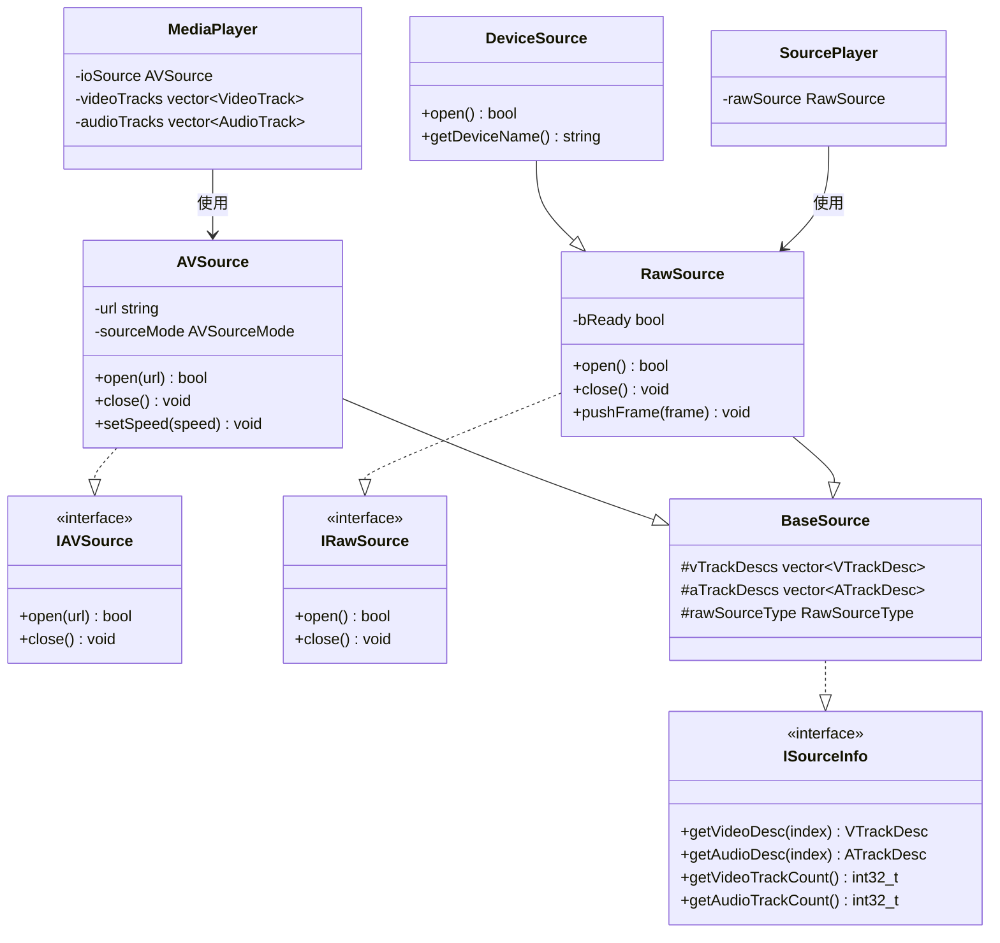

# 数据源

主要分为二类型的数据源，其一是提供需要编解码类型的数据源，音视频数据类似 AAC/H264/H265 这种格式，其二是提供原始数据，比如 PCM/YUV/DX11/OpenGL/Metal 纹理等。

## 主要设计

### BaseSource

编解码类型的数据源与原始数据源都需要的音频与视频的描述信息，如长宽高，帧率，采样率，声道数，码率等。

```cpp
class BaseSource : public ISourceInfo {
protected:
  // 视频轨道描述
  std::vector<VTrackDesc> vTrackDescs;
  // 音频轨道描述
  std::vector<ATrackDesc> aTrackDescs;
  // 原始源类型
  RawSourceType rawSourceType = RawSourceType::none;

public:
  virtual VTrackDesc getVideoDesc(int32_t index = 0) const;
  virtual ATrackDesc getAudioDesc(int32_t index = 0) const;
  virtual int32_t getVideoTrackCount() const;
  virtual int32_t getAudioTrackCount() const;
};
```

### AVSource

提供需要编解码类型的数据源，如 AAC/H264/H265 等，其子类如 FFmpegSource、ZLMediaKitSource 分别可以从媒体文件或网络流里读取数据。

```cpp
class AVSource : public BaseSource,
                 public IAVSource,
                 public Observer<IAVSourceOb> {
protected:
  // 源地址，可能是文件路径，也可能是URL
  std::string url = "";
  // 本地播放源/下载源/直播源
  AVSourceMode sourceMode = AVSourceMode::none;

public:
  // 初始化，打开文件/网络流
  virtual bool open(const char* url) override;
  // 关闭
  virtual void close() override;
  // 设置播放速度（直播变速）
  void setSpeed(double speed);
};
```

### RawSource

提供原始数据，如 PCM/YUV/GPUTexture 这种类型的数据源，其子类 DeviceSource 与 RtcSource。

```cpp
class RawSource : public BaseSource,
                  public IRawSource,
                  public Observer<IRawSourceOb> {
public:
  virtual bool open() override;
  virtual void close() override;
  // 推送原始帧数据
  void pushFrame(const YUVFrame &frame);
  void pushFrame(const GpuFrame &frame);
  void pushFrame(const AvoxAFrame &frame);
};
```

## 源类型枚举

```cpp
// Raw源类型
enum class RawSourceType {
  none,     // 未知类型
  device,   // 设备源（摄像头、麦克风等）
  WebRTC,   // WebRTC源（已解码数据）
};
```

## 设备源

RawSource 的子类 DeviceSource 管理各种能提供音频与视频原始数据的设备，其组合 AudioSource/VideoSource，而 AudioSource/VideoSource 分别由 AudioManager/VideoManager 提供，不同平台提供不同实现：

- **AudioSource 子类**: AndAudioSource (各平台使用原生音频实现)
- **VideoSource 子类**: CaptureWindows, MFCameraSource, AndCameraSource

## 播放器关系

### MediaPlayer (AVSource)

针对 AVSource，MediaPlayer 分别使用 VideoDecoder/AudioDecoder 进行解码，解码后的数据通过 VideoRender/AudioRender 进行渲染。

### SourcePlayer (RawSource)

SourcePlayer 组合则直接使用 AudioRender/VideoRender 进行渲染，无需解码过程。

```cpp
// MediaPlayer 用于播放需要解码的流
class MediaPlayer : public IMediaPlayer,
                    public IAVSourceOb,
                    public BasePlayer,
                    public RunTask {
protected:
  std::unique_ptr<AVSource> ioSource;
  std::vector<VideoTrackPtr> videoTracks;
  std::vector<AudioTrackPtr> audioTracks;
};

// SourcePlayer 用于播放原始数据源
class SourcePlayer : public ISourcePlayer,
                     public IRawSourceOb,
                     public BasePlayer,
                     public RunTask {
protected:
  std::unique_ptr<RawSource> rawSource;
};
```

## 媒体复用

### IOMuxer

负责打开媒体文件/网络流，根据对应协议对 AAC/H264/H265 添加协议数据。

- **IOMuxerFF** - FFmpeg 实现
- **IOMuxerZM** - ZLMediaKit 实现

### MediaMuxer

组合 AVSource/IOMuxer，负责将 AVSource 里的编码流通过 IOMuxer 封装。

### RawMuxer

组合 RawSource/VideoEncoder/AudioEncoder，负责将 RawSource 里的原始数据先通过 VideoEncoder/AudioEncoder 编码后，再转发给 MediaMuxer 处理。

## 类图


