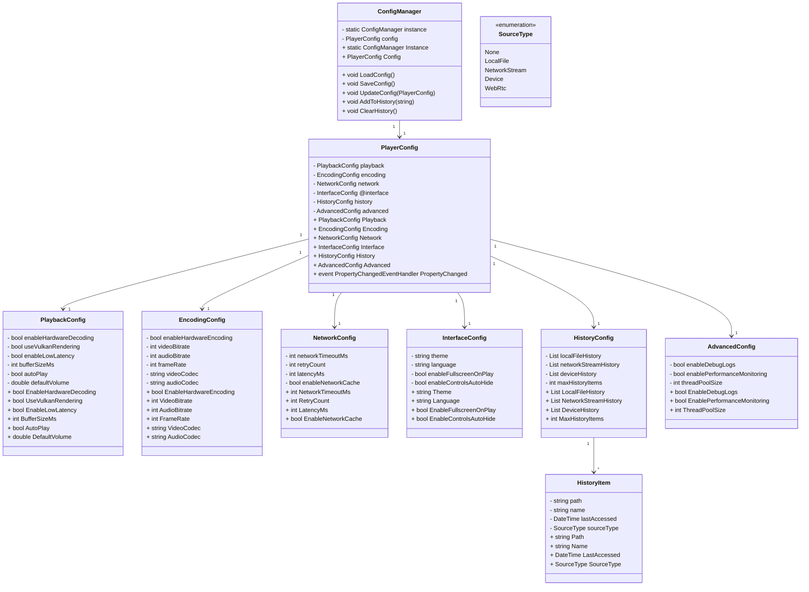

# 配置类设计文档

## 1. 设计目标

- **单例模式**：全局唯一实例，各位置可直接调用
- **跨平台兼容**：支持Windows、Android、iOS等多平台
- **序列化与反序列化**：方便在各平台持久化存储和加载
- **分类管理**：按功能模块组织配置项
- **扩展性**：易于添加新的配置项
- **类型安全**：强类型配置项，避免运行时错误

## 2. 配置结构设计

### 2.1 配置分类

| 分类 | 描述 | 主要配置项 |
|------|------|------------|
| 播放配置 | 与媒体播放相关的设置 | 解码方式、渲染方式、缓冲设置、播放控制等 |
| 编码配置 | 与媒体编码相关的设置 | 编码方式、码率、分辨率、帧率等 |
| 网络配置 | 与网络传输相关的设置 | 延迟设置、缓冲大小、网络协议等 |
| 界面配置 | 与用户界面相关的设置 | 主题、语言、UI行为等 |
| 历史记录 | 媒体源使用历史 | 本地文件历史、网络流历史、设备历史等 |
| 高级配置 | 高级用户设置 | 调试选项、性能参数等 |

### 2.2 核心类结构



## 3. 详细实现设计

### 3.1 单例模式实现

```csharp
public class ConfigManager
{
    // 单例实例
    private static ConfigManager instance;
    private static readonly object lockObj = new object();

    // 配置文件路径（跨平台兼容）
    private static string ConfigPath => GetConfigPath();

    private PlayerConfig config;
    
    // 单例实例属性
    public static ConfigManager Instance
    {
        get
        {
            if (instance == null)
            {
                lock (lockObj)
                {
                    if (instance == null)
                    {
                        instance = new ConfigManager();
                    }
                }
            }
            return instance;
        }
    }

    // 私有构造函数
    private ConfigManager()
    {
        LoadConfig();
    }

    // 跨平台获取配置路径
    private static string GetConfigPath()
    {
        string basePath;
        
        #if ANDROID
            basePath = Android.OS.Environment.ExternalStorageDirectory.AbsolutePath;
            return Path.Combine(basePath, "DDPlayer", "config.json");
        #elif IOS
            var documentsPath = Environment.GetFolderPath(Environment.SpecialFolder.MyDocuments);
            return Path.Combine(documentsPath, "DDPlayer", "config.json");
        #else
            basePath = Environment.GetFolderPath(Environment.SpecialFolder.LocalApplicationData);
            return Path.Combine(basePath, "DDPlayer", "config.json");
        #endif
    }
}
```

### 3.2 序列化与反序列化

```csharp
// 加载配置
public void LoadConfig()
{
    try
    {
        if (File.Exists(ConfigPath))
        {
            var json = File.ReadAllText(ConfigPath);
            config = JsonSerializer.Deserialize<PlayerConfig>(json, new JsonSerializerOptions
            {
                PropertyNamingPolicy = JsonNamingPolicy.CamelCase,
                WriteIndented = true
            });
        }
        else
        {
            config = CreateDefaultConfig();
            SaveConfig();
        }
    }
    catch (Exception ex)
    {
        Console.WriteLine($"加载配置失败: {ex.Message}");
        config = CreateDefaultConfig();
    }
}

// 保存配置
public void SaveConfig()
{
    try
    {
        var directory = Path.GetDirectoryName(ConfigPath);
        if (!Directory.Exists(directory))
        {
            Directory.CreateDirectory(directory);
        }

        var json = JsonSerializer.Serialize(config, new JsonSerializerOptions
        {
            PropertyNamingPolicy = JsonNamingPolicy.CamelCase,
            WriteIndented = true
        });
        File.WriteAllText(ConfigPath, json);
    }
    catch (Exception ex)
    {
        Console.WriteLine($"保存配置失败: {ex.Message}");
    }
}

// 创建默认配置
private PlayerConfig CreateDefaultConfig()
{
    return new PlayerConfig
    {
        Playback = new PlaybackConfig
        {
            EnableHardwareDecoding = true,
            UseVulkanRendering = false,
            EnableLowLatency = false,
            BufferSizeMs = 2000,
            AutoPlay = true,
            DefaultVolume = 0.8
        },
        Encoding = new EncodingConfig
        {
            EnableHardwareEncoding = true,
            VideoBitrate = 2000,
            AudioBitrate = 128,
            FrameRate = 30,
            VideoCodec = "h264",
            AudioCodec = "aac"
        },
        Network = new NetworkConfig
        {
            NetworkTimeoutMs = 10000,
            RetryCount = 3,
            LatencyMs = 2000,
            EnableNetworkCache = true
        },
        Interface = new InterfaceConfig
        {
            Theme = "Default",
            Language = "zh-CN",
            EnableFullscreenOnPlay = false,
            EnableControlsAutoHide = true
        },
        History = new HistoryConfig
        {
            LocalFileHistory = new List<HistoryItem>(),
            NetworkStreamHistory = new List<HistoryItem>(),
            DeviceHistory = new List<HistoryItem>(),
            MaxHistoryItems = 10
        },
        Advanced = new AdvancedConfig
        {
            EnableDebugLogs = false,
            EnablePerformanceMonitoring = false,
            ThreadPoolSize = Environment.ProcessorCount
        }
    };
}
```

### 3.3 配置项访问方法

```csharp
// 播放配置访问
public bool GetEnableHardwareDecoding() => config.Playback.EnableHardwareDecoding;
public void SetEnableHardwareDecoding(bool value)
{
    config.Playback.EnableHardwareDecoding = value;
    SaveConfig();
}

public bool GetUseVulkanRendering() => config.Playback.UseVulkanRendering;
public void SetUseVulkanRendering(bool value)
{
    config.Playback.UseVulkanRendering = value;
    SaveConfig();
}

// 编码配置访问
public bool GetEnableHardwareEncoding() => config.Encoding.EnableHardwareEncoding;
public void SetEnableHardwareEncoding(bool value)
{
    config.Encoding.EnableHardwareEncoding = value;
    SaveConfig();
}

// 网络配置访问
public int GetNetworkLatency() => config.Network.LatencyMs;
public void SetNetworkLatency(int value)
{
    config.Network.LatencyMs = value;
    SaveConfig();
}

// 历史记录管理
public void AddLocalFileHistory(string filePath)
{
    var history = config.History;
    var newItem = new HistoryItem
    {
        Path = filePath,
        Name = Path.GetFileName(filePath),
        LastAccessed = DateTime.Now,
        SourceType = SourceType.LocalFile
    };
    
    AddHistoryItem(history.LocalFileHistory, newItem, history.MaxHistoryItems);
    SaveConfig();
}

public void AddNetworkStreamHistory(string url)
{
    var history = config.History;
    var newItem = new HistoryItem
    {
        Path = url,
        Name = url.Length > 50 ? url.Substring(0, 50) + "..." : url,
        LastAccessed = DateTime.Now,
        SourceType = SourceType.NetworkStream
    };
    
    AddHistoryItem(history.NetworkStreamHistory, newItem, history.MaxHistoryItems);
    SaveConfig();
}

private void AddHistoryItem(List<HistoryItem> historyList, HistoryItem newItem, int maxItems)
{
    // 移除已存在的相同项
    var existingItem = historyList.Find(item => item.Path.Equals(newItem.Path, StringComparison.OrdinalIgnoreCase));
    if (existingItem != null)
    {
        historyList.Remove(existingItem);
    }
    
    // 添加到开头
    historyList.Insert(0, newItem);
    
    // 限制数量
    if (historyList.Count > maxItems)
    {
        historyList.RemoveRange(maxItems, historyList.Count - maxItems);
    }
}
```

### 3.4 配置变更通知

```csharp
// 在PlayerConfig类中
public event PropertyChangedEventHandler PropertyChanged;

protected virtual void OnPropertyChanged(string propertyName)
{
    PropertyChanged?.Invoke(this, new PropertyChangedEventArgs(propertyName));
}

// 在各子配置类中
public class PlaybackConfig : INotifyPropertyChanged
{
    private bool enableHardwareDecoding;
    
    public bool EnableHardwareDecoding
    {
        get => enableHardwareDecoding;
        set
        {
            if (enableHardwareDecoding != value)
            {
                enableHardwareDecoding = value;
                OnPropertyChanged(nameof(EnableHardwareDecoding));
            }
        }
    }
    
    public event PropertyChangedEventHandler PropertyChanged;
    
    protected virtual void OnPropertyChanged(string propertyName)
    {
        PropertyChanged?.Invoke(this, new PropertyChangedEventArgs(propertyName));
    }
}
```

## 4. 使用示例

### 4.1 基本使用

```csharp
// 获取配置管理器实例
var configManager = ConfigManager.Instance;

// 读取配置
bool useHardwareDecoding = configManager.Config.Playback.EnableHardwareDecoding;
bool useVulkanRendering = configManager.Config.Playback.UseVulkanRendering;

// 修改配置
configManager.Config.Playback.EnableHardwareDecoding = true;
configManager.Config.Playback.UseVulkanRendering = false;
configManager.SaveConfig();

// 添加历史记录
configManager.AddNetworkStreamHistory("rtsp://192.168.1.100/live/stream");

// 直接使用配置初始化播放器
var player = new MediaPlayer();
player.SetHardwareDecoding(configManager.Config.Playback.EnableHardwareDecoding);
player.SetVulkanRendering(configManager.Config.Playback.UseVulkanRendering);
```

### 4.2 配置监听

```csharp
// 监听配置变更
ConfigManager.Instance.Config.PropertyChanged += (sender, e) =>
{
    if (e.PropertyName == nameof(PlayerConfig.Playback))
    {
        // 播放配置变更，更新播放器设置
        UpdatePlayerSettings();
    }
};

// 监听子配置变更
ConfigManager.Instance.Config.Playback.PropertyChanged += (sender, e) =>
{
    if (e.PropertyName == nameof(PlaybackConfig.EnableHardwareDecoding))
    {
        // 硬解设置变更
        player.SetHardwareDecoding(ConfigManager.Instance.Config.Playback.EnableHardwareDecoding);
    }
};
```

## 5. 扩展指南

### 5.1 添加新配置项

1. **在相应的配置类中添加属性**：
   ```csharp
   public class PlaybackConfig
   {
       // 现有属性...
       
       private bool enableFrameSkip;
       
       public bool EnableFrameSkip
       {
           get => enableFrameSkip;
           set
           {
               if (enableFrameSkip != value)
               {
                   enableFrameSkip = value;
                   OnPropertyChanged(nameof(EnableFrameSkip));
               }
           }
       }
   }
   ```

2. **在默认配置中添加默认值**：
   ```csharp
   private PlayerConfig CreateDefaultConfig()
   {
       return new PlayerConfig
       {
           Playback = new PlaybackConfig
           {
               // 现有默认值...
               EnableFrameSkip = true
           },
           // 其他配置...
       };
   }
   ```

3. **添加访问方法（可选）**：
   ```csharp
   public bool GetEnableFrameSkip() => config.Playback.EnableFrameSkip;
   public void SetEnableFrameSkip(bool value)
   {
       config.Playback.EnableFrameSkip = value;
       SaveConfig();
   }
   ```

### 5.2 添加新配置分类

1. **创建新的配置类**：
   ```csharp
   public class AudioConfig : INotifyPropertyChanged
   {
       private int sampleRate;
       private int channels;
       
       public int SampleRate
       {
           get => sampleRate;
           set
           {
               if (sampleRate != value)
               {
                   sampleRate = value;
                   OnPropertyChanged(nameof(SampleRate));
               }
           }
       }
       
       public int Channels
       {
           get => channels;
           set
           {
               if (channels != value)
               {
                   channels = value;
                   OnPropertyChanged(nameof(Channels));
               }
           }
       }
       
       public event PropertyChangedEventHandler PropertyChanged;
       
       protected virtual void OnPropertyChanged(string propertyName)
       {
           PropertyChanged?.Invoke(this, new PropertyChangedEventArgs(propertyName));
       }
   }
   ```

2. **在PlayerConfig中添加引用**：
   ```csharp
   public class PlayerConfig
   {
       // 现有配置...
       
       private AudioConfig audio;
       
       public AudioConfig Audio
       {
           get => audio;
           set
           {
               if (audio != value)
               {
                   audio = value;
                   OnPropertyChanged(nameof(Audio));
               }
           }
       }
   }
   ```

3. **在默认配置中初始化**：
   ```csharp
   private PlayerConfig CreateDefaultConfig()
   {
       return new PlayerConfig
       {
           // 现有配置...
           Audio = new AudioConfig
           {
               SampleRate = 44100,
               Channels = 2
           }
       };
   }
   ```

## 6. 平台特定考虑

### 6.1 Windows平台

- **配置存储路径**：`%LOCALAPPDATA%\DDPlayer\config.json`
- **序列化方式**：使用System.Text.Json
- **特殊考虑**：支持长路径和Unicode字符

### 6.2 Android平台

- **配置存储路径**：`/storage/emulated/0/DDPlayer/config.json`
- **权限要求**：需要存储权限
- **序列化方式**：使用System.Text.Json
- **特殊考虑**：处理外部存储访问权限变化

### 6.3 iOS平台

- **配置存储路径**：`/Documents/DDPlayer/config.json`
- **序列化方式**：使用System.Text.Json
- **特殊考虑**：处理应用沙箱限制

## 7. 性能优化

- **延迟加载**：配置项按需加载，避免一次性加载所有配置
- **缓存机制**：缓存频繁访问的配置项
- **批量更新**：支持批量修改配置后一次性保存
- **异步操作**：大配置文件的读写使用异步操作

## 8. 安全性考虑

- **敏感信息保护**：避免存储密码等敏感信息
- **输入验证**：对用户输入的配置值进行验证
- **错误处理**：优雅处理配置文件损坏等异常情况
- **版本兼容性**：支持不同版本配置文件的迁移

## 9. 总结

本设计提供了一个完善的配置管理系统，具有以下特点：

- **结构清晰**：按功能分类组织配置项
- **使用方便**：单例模式，全局可访问
- **跨平台兼容**：支持多平台配置存储
- **扩展性强**：易于添加新配置项和分类
- **类型安全**：强类型配置项，避免运行时错误
- **性能优化**：缓存机制和异步操作
- **安全性高**：合理的错误处理和安全考虑

通过此配置系统，用户可以方便地管理播放器的各种设置，包括硬解、Vulkan渲染、硬编等高级选项，同时保持配置的持久化和跨平台一致性。