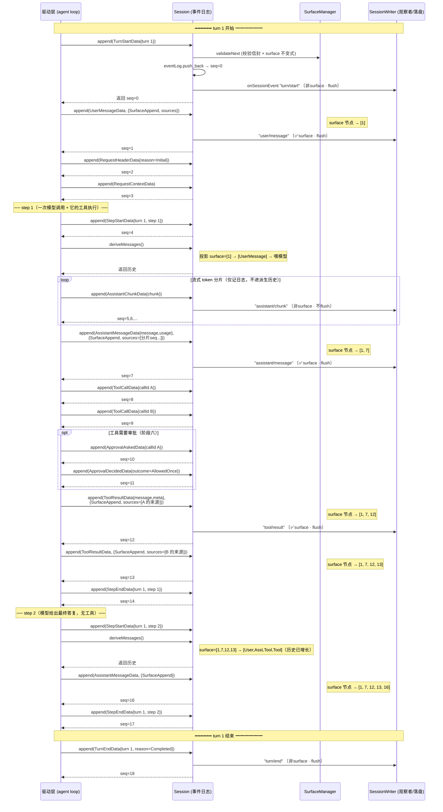

# core 会话日志架构 — 按流程阶段导览

> 范围:`src/avox_agent/core/` 五个模块。本文是**定位手册**:你要做的事(处在哪个阶段)→ 对应的**消息(`EventType`)** → **结构(`*Data` / 投影结构)** → **类/方法**。每个条目都带 `文件:行号`,可点跳。
>
> `core/` 是移植自 deepseek-harness 的 **session 日志系统**,已是唯一活路径(旧 `AgentClient`/`AgentContext`/`TrackRecorder` 已删除)。它的本质是一套**append-only 事件日志**,模型对话历史从它派生。

---

## 0. 一句话定位

> **日志是唯一真相;模型历史是日志的投影;压缩不删历史,只在投影层遮蔽。** —— `SessionTypes.hpp:12-16`

记住这条,后面所有结构/方法的取舍都从它推出。

---

## 1. 五个模块一览

```
SessionTypes.hpp   纯类型词汇表(20 事件 = 19 活跃 + Opaque 墓碑 + 内容块 + surface 标记 + 信封),无类、无逻辑
      │
      ├── Surface.hpp        surface(模型可见表面):投影函数 + SurfaceManager + 全量折叠
      ├── Session.hpp        Session:日志容器 + append + 投影缓存 + 观察者;持有 SurfaceManager
      ├── SessionCodec.hpp   事件 <-> JSONL 一行(编解码,机械转换,dsh wire 形状)
      ├── SessionPersistence.hpp  落盘观察者 SessionWriter + 加载 loadSession(读侧含打包行展开)
      └── DshLayout.hpp      dsh 目录布局(projectKey/encodeSegment → 日志路径)
```

| 文件 | 角色 | 关键导出 |
|------|------|----------|
| `SessionTypes.hpp` | 词汇表(纯声明) | `EventType`(20)、`EventData` variant、`SessionEvent` 信封、20 个 `*Data`、surface 标记、投影结构 |
| `Surface.hpp` | 投影 + 增量表面 | `deriveEventMessage()`、`SurfaceManager`、`foldSurface()` |
| `Session.hpp` | 日志容器(真相源) | `Session`、`SessionObserver`、`kIsSurfacePayload<T>` |
| `SessionCodec.hpp` | JSONL 编解码 | `encodeEvent/encodeHeader`、`decodeEvent/decodeHeader`、`DecodedEvent` |
| `SessionPersistence.hpp` | 持久化 | `SessionWriter`、`LoadedSession`、`loadSession()` |
| `DshLayout.hpp` | 目录布局 | `dshProjectKey()`、`dshEncodeSegment()`、`dshSessionLogPath()` |

依赖方向:`Persistence → Layout → Codec → Session → Surface → Types`(`Types` 是所有人地基)。图片附件字节不进日志,经 `AttachmentStore.hpp`(core 抽象)由 `adapter/DshAttachmentStore` 收进内容寻址仓(`<DSH_HOME>/attachments/v1`)。

---

## 2. 核心心智模型:三层 + 一条契约

```
┌─────────────────────────────────────────────────────────────┐
│  日志层  eventLog: vector<SessionEvent>   ← 唯一真相,append-only │
│           每条带 seq(== 下标,永久稳定)                         │
└──────────────────────────────┬──────────────────────────────┘
                               │ SurfaceManager 把「带 surfaceOp 的事件」挑出来维护成有序表面
                               ▼
┌─────────────────────────────────────────────────────────────┐
│  surface 层  nodes: vector<size_t>(事件 seq 有序列表)            │
│              append 追加尾部 / replace 遮蔽一段区间              │
└──────────────────────────────┬──────────────────────────────┘
                               │ deriveEventMessage() 逐节点投影
                               ▼
┌─────────────────────────────────────────────────────────────┐
│  投影层  vector<Message>(UserMessage/AssistantMessage/ToolResult)│
│          ← 这才是喂给模型的对话历史                              │
└─────────────────────────────────────────────────────────────┘
```

- **只有三类事件能上 surface**:`user/message`、`assistant/message`、`tool/result`(`isSurfaceEventType`,`SessionTypes.hpp:871`)——它们恰好对应模型历史的 user/assistant/tool 三种角色(tool/result 在 wire 上 role 恒 `'user'`,与 dsh 一致)。
- 其余 17 类(边界、分片、header、inbox、seed、压缩、审批、Opaque 墓碑)**不投影成消息**,只记日志。
- **压缩**不删事件,而是往 surface 写一个 `SurfaceReplace`,把被摘要的节点从投影里遮蔽(`Surface.hpp:11`)。

---

## 3. 纵向:会话对象的 6 个生命周期阶段

> 顺着这份清单走,每一步都告诉你「做什么 → 调谁 → 涉及哪些结构」。

### 阶段 A — 加载 / 构造(`loadSession` → `Session` 构造)

**做什么**:从磁盘读回日志(或新建空会话),校验 seed 合法性,构造 `Session`。

| 动作 | 调用 | 涉及结构 |
|------|------|----------|
| 读盘 + 解码 + 修崩溃尾部 | `loadSession(path)` → `LoadedSession` (`SessionPersistence.cpp:188`) | `LoadedSession`(`SessionPersistence.hpp:78`) |
| 解码每行 | `decodeHeader` / `decodeEvent` (`SessionCodec.hpp`) | `DecodedEvent`、`SessionHeader`、`SessionEvent` |
| 补未闭合 turn/step 尾 | `repairOpenTail` (`SessionPersistence.cpp:78`) | `TurnEndInterrupted`、`StepEndData`/`TurnEndData` |
| 构造会话 | `Session(id, seed, header)` (`Session.cpp:40`) | `SessionHeader`、seed=`vector<SessionEvent>` |
| seed 逐条校验 | `SurfaceManager::validateNext` (`Surface.cpp:298`) | `SessionEvent` |

**关键**:
- seed 走与 `append` **完全相同的不变式**(`Session.cpp:64-69`)——坏日志当场拒绝,不会造出后端存不下的活日志。
- seed 末条不是 `session/end-seed` 时构造自动补一条(`Session.cpp:99`)。
- seq 必须从 0 连续(`seq == 下标` 是全系统契约,`Session.cpp:55`)。
- `loadSession` 跳过 ignorable 后若 seq 出现空洞,**直接拒绝**而非重编号(`SessionPersistence.cpp:229-238`)。

### 阶段 B — 挂载持久化(`SessionWriter::attach`)

**做什么**:把落盘观察者挂到会话上,对齐文件与内存。

| 动作 | 调用 | 说明 |
|------|------|------|
| 挂载 | `writer.attach(session, path)` (`SessionPersistence.cpp:109`) | 新文件写 header 行 + 全部事件;旧文件只补 `seq >= 已有行数` |
| 注册观察者 | `session.addObserver(this)` (`Session.hpp:156`) | `SessionWriter` 继承 `SessionObserver` |
| 后续每条事件落盘 | `onSessionEvent` 回调 (`SessionPersistence.cpp:163`) | `chunk` 不立即 flush,其余立即 flush |

**关键**:`attach` 必须对齐——构造期补的 `interrupted`/`end-seed` 若不补写,下次 resume 会再补一遍,日志越长越重复(`SessionPersistence.hpp:46-49`)。失败姿态:磁盘满只 warn,不挡 agent(`SessionPersistence.hpp:31-32`)。

### 阶段 C — 运行时追加事件(`Session::append`)

**做什么**:驱动层每发生一件事,往日志 append 一条事件。这是运行时主循环。

| 事件类别 | append 重载 | 必带参数 | 例子 |
|----------|-------------|----------|------|
| 非 surface(边界/分片/header/...) | `append(T data)` (`Session.hpp:112`) | 仅 data | `append(TurnStartData{...})` |
| surface(user/assistant/tool) | `append(T data, SurfaceIntent)` (`Session.hpp:119`) | data + intent(含 `surfaceOp`) | `append(UserMessageData{...}, {SurfaceAppend{}, {...}})` |

`append` 内部统一走 `appendImpl`(`Session.cpp:123`),固定流水线:
1. **重入检查**(`appending` 标志,`Session.cpp:126`)——观察者回调里不得再 append。
2. **校验不透明 JSON**(`assertOpaqueJson`,`Session.cpp:108`)——`meta`/`toolsJson` 必须是对象/数组。
3. **填信封**:`type`/`seq`/`timeMs`(`Session.cpp:131`)。
4. **surface 校验**:`surfaceManager.validateNext`(`Session.cpp:142`)——抛出则日志不变(坏事件在追加现场失败)。
5. **入库**:`eventLog.push_back`(`Session.cpp:148`)。
6. **发布给观察者**(异常只记 warn,不影响结果,`Session.cpp:159`)。
7. **返回 seq**。

**编译期分流**:`kIsSurfacePayload<T>`(`Session.hpp:46`)在编译期决定你能不能带 `SurfaceIntent`——传错类型编译就过不了。

### 阶段 D — 投影(派生模型历史 / header / context)

**做什么**:在发请求前,把日志折叠成「喂模型的历史」+「请求 header」。

| 要什么 | 调用 | 缓存机制 |
|--------|------|----------|
| 模型历史 | `session.deriveMessages()` → `vector<Message>` (`Session.cpp:178`) | 增量:每节点投影一次;遇 `replace` 整体重建 |
| 表面节点(诊断用) | `session.getSurface().nodes()` (`Surface.hpp:82`) | 惰性追平日志(`processDelta`) |
| 请求 header | `session.requestHeader()` → `EpochHeader*` (`Session.cpp:195`) | 折叠到最后一条 `request/header` |
| 路由元数据 | `session.requestContext()` → `RequestContext*` (`Session.cpp:204`) | 折叠到最后一条 `request/context` |

**投影规则**全在 `deriveEventMessage`(`Surface.cpp:14`):`user/message`→user 消息;`assistant/message`→assistant(空 content 跳过);`tool/result`→tool;其余→`nullopt`。

### 阶段 E — 压缩(可选,替换表面区间)

**做什么**:上下文太长时,把一段 surface 节点替换成摘要。

| 动作 | 调用 | 涉及结构 |
|------|------|----------|
| 打开压缩 | `append(CompactionStartData{...})` (`SessionTypes.hpp:447`) | `CompactionStartData` |
| 写摘要 + 声明替换区间 | `append(AssistantMessageData{...}, {SurfaceReplace{start,end}, sourceEventSeqs})` | `CompactionSummaryData` + `SurfaceReplace` |
| 关闭压缩 | `append(CompactionEndData{...})` (`SessionTypes.hpp:465`) | `CompactionEndData` |

**关键**:`SurfaceReplace` 的 `start/end` 是**事件 seq 不是下标**(下标会漂移,`Surface.hpp:291`);`sourceEventSeqs` 必须覆盖每一个被遮蔽的节点(`Surface.cpp:105-117`)。`tool/result` 的 replace 只能改正文,不能改身份/成败(`assertToolResultRewrite`,`Surface.cpp:168`)。

### 阶段 F — 落盘 / 退出(`detach` / 析构)

| 动作 | 调用 |
|------|------|
| 注销观察者 + 关文件 | `writer.detach()` (`SessionPersistence.cpp:140`,幂等) |
| 手动刷盘 | `writer.flush()` (`SessionPersistence.cpp:158`) |
| 析构自动 detach | `~SessionWriter` (`SessionPersistence.cpp:107`) |

---

## 4. 横向:19 个事件按「词汇表阶段」对照表

> `SessionTypes.hpp:323` 的阶段划分:`turn / step / user / assistant / tool / request / inbox / end-seed / compaction / approval`。
> **surface?** = 是否能携带 `surfaceOp` 进投影(只有 user/assistant-msg/tool-result 三类)。

### 4.1 turn 开合(对话轮)

| wire 名 | EventType | Data 结构 | surface? | 字段 |
|---------|-----------|-----------|----------|------|
| `turn/start` | `TurnStart` | `TurnStartData` (`:328`) | ✗ | `turn` |
| `turn/end` | `TurnEnd` | `TurnEndData` (`:333`) | ✗ | `turn`, `reason: TurnEndReason` |

`TurnEndReason`(`:282`)= `Completed` / `Aborted`(带 `AgentCancelCause`)/ `Blocked` / `Error`(带 `LlmFailure`)/ `MaxTokens` / `Interrupted`(只由 `loadSession` 补写)。

### 4.2 step 开合(一次模型调用 + 它的工具执行)

| wire 名 | EventType | Data 结构 | surface? | 字段 |
|---------|-----------|-----------|----------|------|
| `step/start` | `StepStart` | `StepStartData` (`:339`) | ✗ | `turn`, `step` |
| `step/end` | `StepEnd` | `StepEndData` (`:344`) | ✗ | `turn`, `step` |

### 4.3 user 消息(✅ surface)

| wire 名 | EventType | Data 结构 | surface? | 字段 / 投影 |
|---------|-----------|-----------|----------|------|
| `user/message` | `UserMessageEvent` | `UserMessageData` (`:350`) | ✅ | `message: UserMessage`(`id`,`content: vector<ContentBlock>`,`source: MessageSource`);投影为 `MessageRole::User` |

`MessageSourceKind`(`:141`)= `User`(真人)/ `Plugin`(注入)/ `SkillInvocation` / `Compaction`——三者 content 原样投影,靠 `source` 区分。投影**逐字透传**,不加包装(`Surface.cpp:18-20`)。

### 4.4 assistant(分片 + 装配消息)

| wire 名 | EventType | Data 结构 | surface? | 字段 / 投影 |
|---------|-----------|-----------|----------|------|
| `assistant/chunk` | `AssistantChunk` | `AssistantChunkData` (`:355`) | ✗ | `turn`,`step`,`chunk: ContentBlock`;**仅记日志,不投影** |
| `assistant/message` | `AssistantMessageEvent` | `AssistantMessageData` (`:365`) | ✅ | `turn`,`step`,`message: AssistantMessage`(`content`,`provider`,`model`),`usage: TokenUsage?`;投影为 assistant(**空 content 跳过** `Surface.cpp:28`) |

> 分片是 token 级保真回放;装配消息才是派生历史用的。两者分离是核心设计。

### 4.5 tool(调用 + 结果)

| wire 名 | EventType | Data 结构 | surface? | 字段 / 投影 |
|---------|-----------|-----------|----------|------|
| `tool/call` | `ToolCall` | `ToolCallData` (`:373`) | ✗ | `turn`,`step`,`callId`,`name`,`arguments`(原始 JSON);不单独投影(并入 assistant 消息的 `ToolCallBlock`) |
| `tool/result` | `ToolResult` | `ToolResultData` (`:386`) | ✅ | `turn`,`step`,`message: ToolResultMessage`(`callId`,`content`,`isError`),`error: LlmFailure?`,`meta: string?`(工具私有展示 JSON);投影为 `MessageRole::Tool` |

`callId` 把 `tool/call` 与 `tool/result` 配对——OpenAI 后端严格要求一一对应,否则续发 400(`SessionTypes.hpp:69-71`)。

### 4.6 request(请求 header / 路由)

| wire 名 | EventType | Data 结构 | surface? | 字段 / 用途 |
|---------|-----------|-----------|----------|------|
| `request/header` | `RequestHeaderEvent` | `RequestHeaderData` (`:398`) | ✗ | `header: EpochHeader`(`config`,`adapterDefaults`,`system`,`toolsJson`),`reason: RequestHeaderReason`;**仅记日志**,`requestHeader()` 折叠最后一条 |
| `request/context` | `RequestContextEvent` | `RequestContextData` (`:405`) | ✗ | `context: RequestContext`(`provider`,`model`,`contextWindow`);路由/容量变化时才记 |

`RequestHeaderReason`(`:231`)= `Initial` / `Resume` / `Change`。「header 不变 == 请求前缀字节相同 == KV cache 命中」(`SessionTypes.hpp:216`)。

### 4.7 inbox(待处理消息队列 splice)

| wire 名 | EventType | Data 结构 | surface? | 字段 |
|---------|-----------|-----------|----------|------|
| `agent/inbox/spliced` | `InboxSpliced` | `InboxSplicedData` (`:421`) | ✗ | `target: InboxTarget`,`start`,`removedCount?`,`inserted: vector<UserMessage>`,`canceled` |

`InboxTarget`(`:414`)= `NextTurn`(排队后续轮)/ `NextStep`(当前轮插队池)。「待处理工作」是日志的投影——崩溃重启仍知道有啥没做完(`SessionTypes.hpp:411-413`)。

### 4.8 session/end-seed(种子边界标记)

| wire 名 | EventType | Data 结构 | surface? | 字段 |
|---------|-----------|-----------|----------|------|
| `session/end-seed` | `SessionEndSeed` | `SessionEndSeedData` (`:441`) | ✗ | (空)位置即全部含义 |

区分 seed 历史(replay/fork/resume 进来的)与活跃工作。只有 `Session` 构造函数是合法写入方(`Session.cpp:99`),构造期补写、不发布。

### 4.9 compaction(压缩三件套)

| wire 名 | EventType | Data 结构 | surface? | 字段 |
|---------|-----------|-----------|----------|------|
| `compaction/start` | `CompactionStart` | `CompactionStartData` (`:447`) | ✗ | `compactionId`,`turn?` |
| `compaction/summary` | `CompactionSummary` | `CompactionSummaryData` (`:454`) | ✗ | `compactionId`,`summary`,`rangeStart`,`rangeEnd`,`replacedTokens` |
| `compaction/end` | `CompactionEnd` | `CompactionEndData` (`:465`) | ✗ | `compactionId`,`error?` |

> 摘要**进模型历史**靠的是一条带 `SurfaceReplace` 的 `assistant/message`(阶段 E),不是 `compaction/summary` 本身——后者是「事实记录」。未配对的 `start` = 压缩进行中或崩溃遗留(`SessionTypes.hpp:445-446`)。

### 4.10 approval(审批三件套,阶段六)

| wire 名 | EventType | Data 结构 | surface? | 字段 |
|---------|-----------|-----------|----------|------|
| `approval/policy` | `ApprovalPolicyEvent` | `ApprovalPolicyData` (`:481`) | ✗ | `policy: ApprovalPolicy`(`Ask`/`Never`) |
| `approval/asked` | `ApprovalAsked` | `ApprovalAskedData` (`:486`) | ✗ | `id`,`toolName`,`callId?`,`reason?` |
| `approval/decided` | `ApprovalDecided` | `ApprovalDecidedData` (`:503`) | ✗ | `id`,`outcome: ApprovalOutcome` |

`ApprovalOutcome`(`:495`)= `AllowedOnce` / `Rejected` / `Cancelled` / `Unavailable`(无应答方一律 fail closed)。词汇表**没有**「永久允许」(`SessionTypes.hpp:493-494`)。

---

## 5. 速查表

### 5.1 事件类型总表(19,顺序 = `EventType` 枚举 = `EventData` variant 下标)

| # | EventType | wire 名 | Data | surface | 阶段 |
|---|-----------|---------|------|---------|------|
| 0 | `TurnStart` | `turn/start` | `TurnStartData` | ✗ | turn |
| 1 | `TurnEnd` | `turn/end` | `TurnEndData` | ✗ | turn |
| 2 | `StepStart` | `step/start` | `StepStartData` | ✗ | step |
| 3 | `StepEnd` | `step/end` | `StepEndData` | ✗ | step |
| 4 | `UserMessageEvent` | `user/message` | `UserMessageData` | ✅ | user |
| 5 | `AssistantChunk` | `assistant/chunk` | `AssistantChunkData` | ✗ | assistant |
| 6 | `AssistantMessageEvent` | `assistant/message` | `AssistantMessageData` | ✅ | assistant |
| 7 | `ToolCall` | `tool/call` | `ToolCallData` | ✗ | tool |
| 8 | `ToolResult` | `tool/result` | `ToolResultData` | ✅ | tool |
| 9 | `RequestHeaderEvent` | `request/header` | `RequestHeaderData` | ✗ | request |
| 10 | `RequestContextEvent` | `request/context` | `RequestContextData` | ✗ | request |
| 11 | `InboxSpliced` | `agent/inbox/spliced` | `InboxSplicedData` | ✗ | inbox |
| 12 | `SessionEndSeed` | `session/end-seed` | `SessionEndSeedData` | ✗ | end-seed |
| 13 | `CompactionStart` | `compaction/start` | `CompactionStartData` | ✗ | compaction |
| 14 | `CompactionSummary` | `compaction/summary` | `CompactionSummaryData` | ✗ | compaction |
| 15 | `CompactionEnd` | `compaction/end` | `CompactionEndData` | ✗ | compaction |
| 16 | `ApprovalPolicyEvent` | `approval/policy` | `ApprovalPolicyData` | ✗ | approval |
| 17 | `ApprovalAsked` | `approval/asked` | `ApprovalAskedData` | ✗ | approval |
| 18 | `ApprovalDecided` | `approval/decided` | `ApprovalDecidedData` | ✗ | approval |

> 顺序约束由两道 `static_assert` 把守:`SessionTypes.hpp:544`(variant==19)、`SessionTypes.cpp:38`(名表==variant)。**新增事件必须同步**:枚举、名表 `kEventTypeNames`(`SessionTypes.cpp:16`)、codec 编解码 switch。

### 5.2 自由函数 / 工具谓词(`SessionTypes.hpp:586-611`)

| 函数 | 作用 |
|------|------|
| `eventTypeName(type)` / `fromEventTypeName(name)` | EventType ↔ wire 名(`SessionTypes.cpp:43/51`) |
| `eventTypeOf(data)` | EventData variant 下标 → EventType(`SessionTypes.cpp:58`) |
| `isSurfaceEventType(type)` | 是否**允许**携带 surfaceOp(3 类) |
| `isSurfaceEvent(e)` | 类型可上 surface **且**确实带了标记 |
| `isAppendSurfaceEvent(e)` | append 来源(给 UI transcript 用,`Surface.hpp:604` 注释) |
| `isReplacementSurfaceEvent(e)` | replace 来源(遮蔽了既有区间) |
| `deriveEventMessage(e)` | 单事件投影成 Message(`Surface.cpp:14`) |
| `foldSurface(events)` | 全量折叠(诊断/seed 校验,`Surface.cpp:260`) |
| `encodeEvent/Header` · `decodeEvent/Header` | JSONL 编解码(`SessionCodec.*`) |
| `loadSession(path)` | 读盘(`SessionPersistence.cpp:188`) |

### 5.3 类方法索引

**`Session`(`Session.hpp:51`)** — 不可拷贝/移动(`getSurface` 借日志引用):

| 分类 | 方法 | 位置 |
|------|------|------|
| 构造 | `Session(id, seed=?, header=?)` | `:64` |
| 身份 | `getHeader()` `id()` `getFirstLiveSeq()` | `:75-86` |
| 日志 | `events()` `seq()` | `:94-97` |
| 追加 | `append(data)` [非surface] `append(data, intent)` [surface] | `:112-123` |
| 投影 | `getSurface()` `deriveMessages()` `requestHeader()` `requestContext()` | `:128-151` |
| 观察者 | `addObserver(ob)` `removeObserver(ob)` | `:156-157` |
| private | `appendImpl` `assertOpaqueJson` | `:160-166` |

**`SurfaceManager`(`Surface.hpp:75`)** — 借 `eventLog` 引用:

| 方法 | 作用 |
|------|------|
| `SurfaceManager(eventLog)` | 构造(`:78`) |
| `nodes()` | 当前表面 seq 列表(惰性追平) |
| `replaceGeneration()` | 替换次数(投影缓存据此判断整体重建) |
| `validateNext(event, expectedSeq)` | **入库前**校验候选事件(抛则不进日志) |

**`SessionWriter`(`SessionPersistence.hpp:33`,继承 `SessionObserver`)**:

| 方法 | 作用 |
|------|------|
| `attach(session, path)` | 挂载 + 对齐 + 注册观察者 |
| `detach()` / `flush()` | 注销/关文件(幂等) / 刷盘 |
| `path()` `lastError()` | 查询 |
| `onSessionEvent(...)` | 落盘回调(chunk 不 flush) |

**`SessionObserver`(`Session.hpp:31`)** — 抽象基类:
- `onSessionEvent(session, event)` —— 持久化、UI、遥测都挂这里。

### 5.4 校验闸门汇总(不变式 → 在哪强制)

| 不变式 | 强制点 |
|--------|--------|
| `EventType` 顺序 == variant 顺序 | `static_assert` `SessionTypes.hpp:544` / `SessionTypes.cpp:38` |
| `seq == 日志下标`(连续) | seed:`Session.cpp:55`;load:`SessionPersistence.cpp:229` |
| 类型标签 == 载荷 variant | seed:`Session.cpp:50`;`eventTypeOf` 依赖此 |
| 版本 == `SESSION_FORMAT_VERSION` | 构造:`Session.cpp:83`;load:`decodeHeader` |
| 非 surface 事件不得带 surfaceOp | `readSurfaceOp` `Surface.cpp:69` |
| surface append/replace 区间合法 | `planSurfaceEvent`/`replacementRange` `Surface.cpp:197/121` |
| `sourceEventSeqs` 更早/不重复/覆盖遮蔽节点 | `assertProvenance` `Surface.cpp:79` |
| `tool/result` replace 只改正文 | `assertToolResultRewrite` `Surface.cpp:168` |
| 不透明 JSON(`meta`/`toolsJson`)合法 | `assertOpaqueJson` `Session.cpp:108` |
| 发布窗口内不重入 append | `appending` 标志 `Session.cpp:126` |
| 未识别必需事件必须拒绝(非静默丢) | `decodeEvent` `SessionCodec.hpp:44`;`ignorable` 标记覆盖词汇表增长 |

---

## 6. 定位口诀(「我想找 X」→ 去哪)

- **事件怎么变成发给模型的消息?** → `deriveEventMessage` (`Surface.cpp:14`) + `Session::deriveMessages` (`Session.cpp:178`)。
- **surface 是怎么维护的 / replace 怎么遮蔽?** → `SurfaceManager::processDelta` (`Surface.cpp:289`) + `applySurfacePlan` (`Surface.cpp:230`)。
- **append 一条事件会做哪些校验?** → `Session::appendImpl` (`Session.cpp:123`) → `SurfaceManager::validateNext` (`Surface.cpp:298`)。
- **磁盘上的日志什么格式 / 怎么读回?** → `loadSession` (`SessionPersistence.cpp:188`);文件格式见 `SessionPersistence.hpp:10-15`。
- **崩溃没写完的 turn 怎么办?** → `findOpenTail`/`repairOpenTail` (`SessionPersistence.cpp:45/78`),补 `TurnEndInterrupted`。
- **压缩怎么让历史变短但不删日志?** → `SurfaceReplace` (`SessionTypes.hpp:298`) + 阶段 E。
- **新增一个事件类型要改哪些地方?** → 5.1 表末注释(枚举 + 名表 + codec + static_assert)。
- **为什么只有三类事件能上 surface?** → 本文 §0 + `isSurfaceEventType` (`SessionTypes.hpp:587`)。
- **请求 header / KV cache 命中怎么判断?** → `requestHeader` (`Session.cpp:195`) + `EpochHeader` 注释 (`SessionTypes.hpp:216`)。
- **给用户看的对话记录该用哪个判定?** → `isAppendSurfaceEvent` (`SessionTypes.hpp:604`,**别直接读 surface**)。

---

## 7. 时序图:一次完整 turn(从 `turn/start` 到 `turn/end`)

下图是一个**完整 turn** 的全部事件流。示例为 turn 1:用户提问 → 模型在第 1 步调了 2 个工具(其一需审批)→ 第 2 步给出最终答复 → turn 结束。



**读图说明:**

| 符号/约定 | 含义 |
|-----------|------|
| 实线箭头 `->>` | 驱动层的一次 `append(...)` **写**调用(或 `deriveMessages()` 读调用) |
| 虚线箭头 `-->>` | 返回值(几乎都是新事件的 `seq`) |
| `〔✅surface〕` | 该事件带 `SurfaceAppend`,会进 `SurfaceManager.nodes()` 与派生历史 |
| `〔非surface〕` | 仅记日志,不进模型历史(边界 / 分片 / header / 审批) |
| `flush` / `不flush` | `SessionWriter` 是否立即刷盘——分片量大、丢了只影响 token 级回放,故不 flush(`SessionPersistence.cpp:172`) |
| 右侧 `surface → [...]` | 该 append 后,有序表面的**事件 seq 列表**怎么变;最终 `[1,7,12,13,16]` 就是 `deriveMessages` 的投影来源 |
| `seq=N` | 事件在日志中的下标,恒等于 `Session::seq()`(`seq == 下标` 契约) |

**关键看点:**

- **只有 4 处 append 带 `SurfaceIntent`**:`user/message`(seq 1)、`assistant/message`(seq 7、16)、`tool/result`(seq 12、13)。这五条才是模型历史;其余全部 `〔非surface〕`。
- **`assistant/chunk` 与 `assistant/message` 分离**:分片保 token 级回放但永不投影;装配消息才上 surface。这是「日志保真 ⟷ 派生历史精简」的解耦点。
- **`deriveMessages()` 在每个 step 发请求前调一次**(seq 4 后、seq 15 后):增量投影,只算新节点;`surface=[...]` 越长,返回的历史越长。
- **审批夹在 `tool/call` 与 `tool/result` 之间**:callId 把三者串起来;审批事件本身不上 surface,只影响「这次调用是否真的执行」。
- **seq 严格连续递增**=日志下标:这是 `sourceEventSeqs` 与 `SurfaceReplace` 区间能稳定引用的基础。

### 附:压缩如何改写这个表面(replace,非 append)

压缩**不是**上面的 append 流,而是一次 `SurfaceReplace`——把一段既存节点整体顶替成一条摘要消息:

```
压缩前 surface = [1(user), 7(asst), 12(tool), 13(tool), 16(asst)]
                  └──────── 被摘要区间 [7,13] ────────┘
                  compaction/start → compaction/summary(记事实) → 一条带
                  SurfaceReplace{start=7,end=13} 的 assistant/message(seq=20)
压缩后 surface = [1(user), 20(摘要), 16(asst)]
```

被遮蔽的 seq 7/12/13 **仍在日志里**(审计、回放、UI transcript 还看得到),只是不再进 `deriveMessages`。`sourceEventSeqs=[7,12,13]` 必须覆盖被遮蔽的每一个节点,否则 `assertProvenance` 拒绝(`Surface.cpp:105`)。这正对应 §0 那条「压缩不删历史,只在投影层遮蔽」。

---

## 附:wire 字段名(与 dsh 逐字一致,日志可跨实现对照)

事件信封 `SessionEvent`(`SessionTypes.hpp:553`)的字段:`type` / `seq` / `time`(C++ 成员叫 `timeMs`,单位显式)/ `data` / `surfaceOp` / `sourceEventSeqs` / `ignorable`。存储元数据 `SessionHeader` 单独成首行。详见 `SessionCodec.hpp:9-13`。
